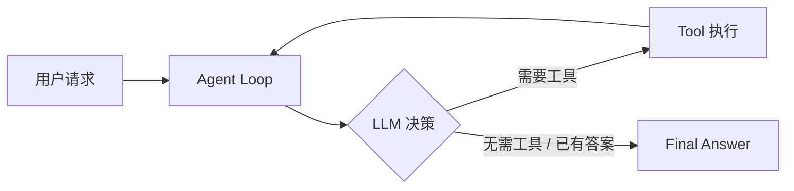
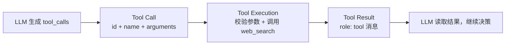

# Final Architecture

This document describes the actual, current implementation of the minimal
research agent in `src/` and `tests/`. It does not introduce any new
functionality — it explains what exists today.

## 1. Agent 的定义

在这个项目里，"Agent" 指的是：

> 一个由 **LLM 自主决策** 驱动、能够 **调用外部工具** 与真实世界交互、并在
> **有限的、受控的循环** 中持续"观察 → 决策 → 行动"，直到自己判断任务完成或
> 达到安全上限为止的系统。

它不是 LLM 本身，也不是一次性的 prompt→completion 调用。它是
**LLM + Tools + State + Control Loop** 四者的组合（详见 `docs/AGENT-DESIGN.md`
第 1 节），由 `src/agent.py` 中的 `run_agent()` 函数具体实现。

关键点：

- 决策权在 LLM，不在 Python 代码里的 if-else。
- Python 代码只负责：提供工具、执行工具、维护状态、保证循环有边界。

## 2. Agent Loop

`src/agent.py` 中的 `run_agent()` 是唯一的循环实现：

```python
for turn in range(1, max_turns + 1):
    state["turns"] = turn
    response = _call_llm(llm, state["messages"], state["errors"])
    ...
    tool_calls = response.get("tool_calls") or []
    content = response.get("content")
    if not tool_calls:
        ...                      # 无工具调用 → 判定为最终答案或异常，return
    state["messages"].append(
        {"role": "assistant", "content": content, "tool_calls": tool_calls}
    )
    for tool_call in tool_calls:
        tool_result = _execute_web_search(tool_call, web_search)
        state["tool_calls"].append(tool_result)
        state["messages"].append({"role": "tool", ...})
# 循环体外：达到 max_turns 仍未 return，则强制结束
state["status"] = "limit_reached"
```

这是一个**有限状态机**：每一轮向 LLM 提问一次，根据它的响应决定"继续循环"还是
"return 结束"。循环没有隐藏的分支路径，所有终止点都是显式的 `return state`。

## 3. LLM

LLM 是循环中**唯一的决策来源**。它通过 `src/llm_client.py` 中的
`OpenAICompatibleClient` 接入：

```python
class OpenAICompatibleClient:
    def complete(self, messages, tools) -> dict[str, Any]:
        ...
        message = payload["choices"][0]["message"]
        return {
            "content": message.get("content"),
            "tool_calls": message.get("tool_calls", []),
        }
```

`agent.py` 通过 `LLMClient(Protocol)` 这个结构化类型（不要求继承）来约束
"任何可传入 `run_agent` 的 LLM 客户端只需要有 `complete(messages, tools) ->
dict` 方法"。这使得真实的 `OpenAICompatibleClient` 和测试/评测中的
`ScriptedLLM`/`FakeLLM` 可以互相替换，agent 逻辑本身不知道、也不关心背后是
真实 API 还是脚本回放。

LLM 从不直接执行代码或访问网络；它只输出结构化的"决定"（文本答案，或工具调用
请求）。

## 4. Instructions

Instructions（系统提示词）定义在 `src/prompts.py`：

```python
SYSTEM_PROMPT = """You are a concise research assistant.
Use web_search when the question needs current, factual, or source-dependent information.
Use the search results as evidence. If the results are sufficient, answer the user's question
and mention the relevant source URLs. If they are insufficient, make a more specific search.
Do not call a tool when you are ready to provide the final answer."""
```

它作为对话历史的第一条消息注入 `state["messages"]`（见 `run_agent` 初始化
`state` 时的 `{"role": "system", "content": SYSTEM_PROMPT}`）。这段文本是
LLM 决策策略的唯一来源：何时该搜索、何时该停止、如何引用来源，都靠这段
Instructions 引导，而不是 Python 代码里的规则。

## 5. Tools

当前只有一个工具，定义在 `src/tools.py`：

- **工具 Schema**（提供给 LLM，声明它能"看到"并可以请求的能力）：
  ```python
  WEB_SEARCH_TOOL = {
      "type": "function",
      "function": {
          "name": "web_search",
          "description": "Search the web for current, factual information.",
          "parameters": {
              "type": "object",
              "properties": {"query": {"type": "string", ...}},
              "required": ["query"],
              "additionalProperties": False,
          },
      },
  }
  ```
- **工具实现**（真正执行动作的 Python 函数）：
  ```python
  def web_search(query: str) -> dict[str, Any]:
      ...
      with urlopen(request, timeout=10) as response:
          payload = json.load(response)
      ...
      return {"query": query, "results": results}
  ```

Schema 与实现是分离的：LLM 只看到 Schema（通过 `_call_llm` 里
`llm.complete(messages, [WEB_SEARCH_TOOL])` 传入），实际的 HTTP 请求只发生在
Python 侧的 `web_search()` 函数里，LLM 永远无法绕过这层。

## 6. Tool Calling

Tool Calling 指"LLM 请求执行某个工具"这一协议动作，具体流转：

1. LLM 响应中带有 `tool_calls`（由 `llm_client.py` 从 API 响应解析出来）。
2. `run_agent()` 把整个 `tool_calls` 列表原样写入一条 `assistant` 消息：
   ```python
   state["messages"].append(
       {"role": "assistant", "content": content, "tool_calls": tool_calls}
   )
   ```
3. 对每个 tool_call，调用 `_execute_web_search(tool_call, web_search)` 做
   **校验 + 执行**：
   ```python
   def _execute_web_search(tool_call, web_search):
       call_id = tool_call.get("id")
       function = tool_call.get("function", {})
       name = function.get("name")
       if not isinstance(call_id, str) or not call_id:
           return _tool_error("", "INVALID_TOOL_CALL", ...)
       if name != "web_search":
           return _tool_error(call_id, "UNKNOWN_TOOL", ...)
       arguments = json.loads(function.get("arguments", "{}"))
       ...
       result = web_search(query)
       return {"tool_call_id": call_id, "name": "web_search",
               "status": "success", "content": result}
   ```

自本项目实现"多工具调用支持"以来（见项目历史：初版只允许 1 个
`tool_call`，后改为 `for tool_call in tool_calls:` 循环处理任意数量的并行
tool_calls），**一轮 LLM 响应可以包含 0 个、1 个或多个 tool_calls**，
`run_agent()` 都会逐一处理。

## 7. State

State 是**一次运行（run）**期间由 Python 应用维护的结构化数据，定义在
`run_agent()` 开头：

```python
state: dict[str, Any] = {
    "run_id": str(uuid4()),
    "status": "running",
    "question": question,
    "messages": [...],
    "turns": 0,
    "tool_calls": [],
    "errors": [],
    "final_answer": None,
}
```

- `messages`：完整对话历史，是 LLM 每轮决策的唯一上下文来源。
- `turns` / `tool_calls` / `errors`：用于可观测性、评测和安全限制，**不会**
  被序列化进 LLM 看到的消息，只在 Python 侧使用。
- `status` / `final_answer`：运行结果，供调用方（`src/main.py` 或评测
  Runner）读取。

State 完全在内存中，属于一次 `run_agent()` 调用的生命周期，不跨运行持久化。

## 8. Observation

Observation 是"工具执行结果被回灌进 LLM 能看到的对话历史"这一步：

```python
state["messages"].append(
    {
        "role": "tool",
        "tool_call_id": tool_result["tool_call_id"],
        "content": json.dumps(tool_result, ensure_ascii=False),
    }
)
```

没有这一步，LLM 在下一轮循环中就无法"知道"上一次工具调用发生了什么，Agent
Loop 就无法闭环成"根据新证据继续决策"。

## 9. Decision

Decision 完全由 LLM 产生，Python 代码只是**读取**这个决策结果并路由执行：

```python
tool_calls = response.get("tool_calls") or []
content = response.get("content")
if not tool_calls:
    ...   # LLM 决定：不需要工具，给出答案（或异常）
else:
    ...   # LLM 决定：需要执行一个或多个工具
```

`response` 本身来自 `llm_client.py` 对 API 响应的解析，其中的
`tool_calls`/`content` 字段值是模型推理的直接产物，Python 端不做任何"该不该
搜索"的判断。

## 10. Termination

循环有且只有 3 种终止状态，分别对应 4 处显式 `return`：

1. **`failed`（LLM API 失败）**：
   ```python
   if response is None:
       state["status"] = "failed"
       ...
       return state
   ```
2. **`failed`（响应既非工具调用也非有效文本）**：
   ```python
   if not isinstance(content, str) or not content.strip():
       state["status"] = "failed"
       ...
       return state
   ```
3. **`completed`（LLM 主动给出最终答案，无 tool_calls）**：
   ```python
   state["status"] = "completed"
   state["final_answer"] = content
   return state
   ```
4. **`limit_reached`（循环体执行完 `max_turns` 次仍未 return）**：
   ```python
   state["status"] = "limit_reached"
   state["final_answer"] = "Research stopped because the maximum number of LLM turns was reached."
   return state
   ```

前三种是"提前"终止（在 `for` 循环体内 `return`），第四种是循环自然耗尽后、
函数末尾的兜底逻辑。

## 11. `max_turns`

`max_turns` 是防止无限循环的**硬性预算**，默认值 5：

```python
def run_agent(question, llm, web_search, max_turns: int = 5) -> dict[str, Any]:
    ...
    if max_turns < 1:
        raise ValueError("max_turns must be at least 1")
    ...
    for turn in range(1, max_turns + 1):
        state["turns"] = turn
        ...
```

每一轮（无论 LLM 是请求工具还是给出答案）都消耗一次 `turn` 额度。只要循环跑满
`max_turns` 次仍未通过前三种方式提前 `return`，函数末尾会强制返回
`limit_reached` 状态。调用方（`src/main.py`）在启动 agent 时传入
`max_turns=5`；评测 Runner（`tests/evaluations/`）会针对不同 `max_turns`
值（如 2、3、5）测试触发/不触发该限制的场景。

## 12. Error Handling

错误分两个层面处理，均遵循"显式、结构化、有限重试"的原则：

**LLM API 层**（`_call_llm`，最多重试 1 次）：
```python
def _call_llm(llm, messages, errors):
    for attempt in range(1, 3):
        try:
            return llm.complete(messages, [WEB_SEARCH_TOOL])
        except LLMError as error:
            errors.append(str(error))
            if attempt == 1:
                time.sleep(1)
    return None
```

**工具执行层**（`_execute_web_search`，把各种失败转成结构化 tool 错误结果，
而不是让程序崩溃）：
```python
def _tool_error(tool_call_id, code, message):
    return {"tool_call_id": tool_call_id, "name": "web_search",
            "status": "error", "error": {"code": code, "message": message}}
```
覆盖的错误类型：`INVALID_TOOL_CALL`（缺失 id）、`UNKNOWN_TOOL`（非
`web_search`）、`INVALID_ARGUMENTS`（JSON 解析失败/参数不合法）、
`TOOL_EXECUTION_FAILED`（`web_search()` 内部抛异常，如网络失败）。

所有工具错误都会被**作为一条 `role: tool` 消息回传给 LLM**（而不是直接终止
循环），让 LLM 有机会基于错误信息调整策略（换个查询、放弃搜索直接回答、或
如实告知用户无法获取信息）——这一策略同样在
`tests/evaluations/cases.json` 的 `case-05-tool-error` 中被验证。

## 13. Evaluation

评测系统位于 `tests/evaluations/`，是一个**确定性（deterministic）、非
LLM-as-a-Judge** 的最小 Evaluation Harness：

- **`cases.json`**：10 个纯数据测试案例，覆盖：无需工具的简单问题、单次搜索、
  多次搜索、空结果、工具报错、含糊问题、多信息请求、达到 `max_turns`、
  结果矛盾、正常完成的复杂问题。每个案例定义 `input`、`max_turns`、
  `expected_behavior`、`expected_tool_usage`，以及一段脚本化的 `turns`
  （模拟 LLM 响应序列和工具结果/错误）。
- **`run_evaluations.py`**：
  - `ScriptedLLM` 按脚本重放响应（满足 `LLMClient` Protocol），
    `build_scripted_web_search` 按 query→result/error 映射构造确定性工具。
  - `evaluate_case()` **调用真实的 `run_agent()`**（不 mock 循环逻辑本身），
    只对 LLM 和工具做脚本替身，然后用纯 Python 断言检查：
    - 是否无异常运行完成；
    - `turns` 是否未超过 `max_turns`；
    - 是否停在终止状态（`completed` / `limit_reached` / `failed`）；
    - 状态是否匹配 `expected_behavior`，是否产生非空 `final_answer`；
    - 工具调用次数、工具名是否落在预期范围内；
    - 是否按预期出现/未出现工具错误，错误码是否匹配。
  - 提供 CLI（`python -m tests.evaluations.run_evaluations`）逐案例打印
    PASS/FAIL。
- **`tests/test_evaluations.py`**：把上述 Harness 接入现有
  `unittest discover`，使评测成为常规测试套件的一部分。

这套 Evaluation 刻意不引入任何"LLM 打分/评审"机制——所有判定都是可重复、
可解释的布尔断言，符合"先用确定性断言，再考虑更复杂评测方式"的设计目标。

---

## Diagram 1：单次请求的端到端流程



对应代码：`src/main.py` 调用 `run_agent(question, llm, web_search, ...)` →
`run_agent()` 内的 `for turn in ...` 循环 → 每轮调用 `llm.complete(...)`
做决策 → 若有 `tool_calls` 则执行 `_execute_web_search()` 并回到循环顶部；
若无 `tool_calls` 且有有效 `content`，则 `state["final_answer"] = content`
并 `return`。

## Diagram 2：单次 Tool Calling 的内部流程



对应代码：`response.get("tool_calls")`（LLM 输出）→
`_execute_web_search(tool_call, web_search)`（校验 + 执行，内部调用
`web_search(query)`）→ 返回值封装为
`{"tool_call_id", "name", "status", "content"/"error"}`（Tool Result）→
`state["messages"].append({"role": "tool", ...})`（写回对话历史）→ 下一轮
`_call_llm()` 把包含该结果的完整 `messages` 再次发给 LLM。

---

## 如果现在使用 OpenAI Agents SDK 重写这个项目，SDK 替我们管理了哪些东西？

如果改用 OpenAI Agents SDK（或同类 Agent Framework），以下当前由本项目手写
的部分会被 SDK 接管，不再需要自己实现：

1. **Agent Loop 本身**：SDK 内置了"调用模型 → 检查是否有 tool 调用 → 执行
   工具 → 把结果喂回模型 → 循环"的完整控制流（对应 `src/agent.py` 里手写的
   `for turn in range(1, max_turns + 1): ...`）。我们不再需要自己写这个
   状态机。

2. **多 Tool Calls 的并行/顺序编排**：SDK 自动处理一轮响应中多个 tool_calls
   的执行、结果收集与顺序回传（对应我们手写的
   `for tool_call in tool_calls: ...` 循环）。

3. **Tool Schema 生成与参数校验/绑定**：SDK 通常能从一个带类型注解的 Python
   函数自动生成 JSON Schema，并自动解析/校验 LLM 返回的参数、绑定成函数调用
   （对应 `src/tools.py` 里手写的 `WEB_SEARCH_TOOL` JSON Schema，以及
   `_execute_web_search()` 里手写的 JSON 解析、字段校验、未知参数拒绝逻辑）。

4. **对话状态 / 消息历史管理**：SDK 通常自带 `messages`/`Runner` 级别的
   状态对象，自动维护 assistant/tool 消息的正确顺序和 `tool_call_id`
   关联（对应我们手写维护 `state["messages"]` 及其 append 顺序）。

5. **多 Provider/多模型适配**：SDK 提供统一的模型客户端抽象层，屏蔽不同
   LLM 提供商 API 格式差异（对应我们手写的 `llm_client.py` 里
   `OpenAICompatibleClient` 对 `/chat/completions` 响应格式的手动解析）。

6. **重试与错误处理的基础设施**：SDK 通常内置对模型 API 瞬时错误的重试、
   超时处理（对应我们手写的 `_call_llm()` 里 `for attempt in range(1, 3)`
   重试逻辑），以及工具异常到"结构化错误结果"的标准化转换（对应
   `_tool_error()`）。

7. **停止/终止条件与安全上限**：SDK 通常提供内置的 `max_turns`/最大步数
   概念和终止状态上报（对应我们手写的 `max_turns` 循环边界和
   `status` 状态机：`completed`/`limit_reached`/`failed`）。

8. **可观测性/追踪（tracing）**：多数 Agent SDK 自带运行追踪、每步日志、
   工具调用记录（对应我们手写的 `print(...)` 日志和 `state["tool_calls"]`
   记录列表）。

**SDK 不会替我们管理的部分**（仍需自己决定/实现）：

- **业务语义层面的决策**：系统提示词（Instructions）里"什么时候该搜索、
  什么时候该停止、如何解读矛盾证据"这些策略仍然要自己写（`src/prompts.py`）。
- **工具的具体业务逻辑**：`web_search()` 里访问 DuckDuckGo API、解析
  `AbstractURL`/`RelatedTopics` 的业务代码，SDK 不会替你写。
- **评测（Evaluation）**：`tests/evaluations/` 里针对本项目场景设计的
  10 个测试案例和断言逻辑，是项目特定的质量保证手段，任何框架都不会自动
  提供针对你的业务问题的评测用例。
- **对结果的最终业务判断**：例如"矛盾证据要不要都呈现给用户""空结果要不要
  如实告知限制"，这些仍然是你在 Instructions 和评测中要定义的期望行为。

一句话总结：**SDK 主要接管"工程基础设施"部分（循环、状态、Schema 生成、
错误处理、多 Provider 适配、可观测性），但不会替你做"Agent 该怎么想、
该在什么场景下做什么"这类业务与产品决策**——这部分仍然由 Instructions、
Tool 设计和 Evaluation 用例来定义，与是否使用框架无关。
