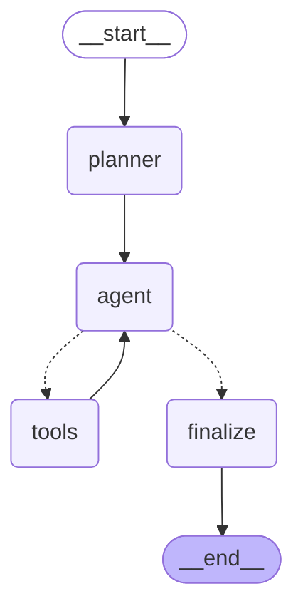

# 05 - 完整的 LangGraph Research Agent

对应代码：`src/05_research_agent.py`
对应测试：`tests/test_research_agent.py`

这是本系列实验的集大成之作：把实验 #3（Prompt Chaining Graph）和实验 #4
（Conditional Edge / Agent Loop）合并成一个真正"会自己判断要不要继续研究"的
Research Agent。

用户输入一个研究问题（例如"比较 Python、TypeScript 和 Go 哪个更适合开发
AI Agent"），Graph 会：

1. **分析问题、制定研究计划** —— `planner`
2. **决定是否需要搜索、调用 `search_web`** —— `agent` + `tools`
3. **根据搜索结果判断是否需要继续研究** —— `should_continue`（Conditional Edge）
4. **汇总研究结果、生成最终答案** —— `finalize`

## Graph 结构

```
START
  |
  v
planner
  |
  v
agent  <---------------------.
  |                          |
  v                          |
should_continue                |
  |-- "tools" --> tools ------'
  `-- "finalize" --> finalize --> END
```

### Mermaid Diagram（由 `graph.get_graph().draw_mermaid()` 生成）



（图中实线是普通 Edge，虚线是 Conditional Edge 的两个分支：`agent -.-> tools`
和 `agent -.-> finalize`。）

`src/05_research_agent.py` 里的 `print_mermaid_diagram(graph)` 会打印同样
的内容；运行 `python -m src.05_research_agent` 也会在结果之前先打印一次。

## State

```python
class ResearchAgentState(TypedDict):
    question: str
    plan: str
    messages: list[dict]
    pending_tool_call: ToolCall | None
    tool_results: list[ToolResult]     # 需求 3：每次 Tool 结果都写入 State
    steps: int                          # 需求 4：配合 max_steps 防止无限循环
    final_answer: str
```

| 字段                | 由谁写入      | 用途                                             |
|---------------------|---------------|--------------------------------------------------|
| `question`          | 调用方（只读）| 全程不变的原始问题                                |
| `plan`              | `planner`     | 研究计划，同时会被塞进 `agent` 的 system prompt   |
| `messages`          | `planner`/`agent`/`tools`（各自追加）| Agent Loop 的完整对话历史          |
| `pending_tool_call` | `agent` 写 / `tools` 清空 | 驱动 `should_continue` 路由的关键字段 |
| `tool_results`      | `tools`       | **结构化**的搜索结果列表，不是塞在 `messages` 里就完事 |
| `steps`             | `agent`       | 已执行的决策轮数，超过 `max_steps` 强制停止        |
| `final_answer`       | `finalize`    | 最终答案                                          |

## 四个 Node

### 1. `planner` —— 分析问题 + 制定研究计划

```python
def planner(state):
    plan = text_llm_call(PLANNER_INSTRUCTIONS, state["question"])
    seeded_messages = [
        {"role": "system", "content": AGENT_SYSTEM_PROMPT_TEMPLATE.format(question=..., plan=plan)},
        {"role": "user", "content": state["question"]},
    ]
    return {"plan": plan, "messages": seeded_messages}
```

只写 `plan` 和 `messages`（为后面的 Agent Loop 播种对话历史）。

### 2. `agent` —— 决定"要不要继续研究"

```python
def agent(state):
    steps = state["steps"] + 1
    if steps > max_steps:                       # 需求 4：最大循环次数
        return {"steps": steps, "pending_tool_call": None, "messages": [...]}

    decision = agent_llm_call(state["messages"])  # 需求 5：真的调用 LLM
    if "tool_call" in decision:
        return {"messages": [...], "pending_tool_call": decision["tool_call"], "steps": steps}
    else:
        return {"messages": [...], "pending_tool_call": None, "steps": steps}
```

这里的 `agent_llm_call` 是把 `messages` 发给真实的 LLM（用最基础的
`openai.chat.completions.create(..., tools=[search_tool_schema])`，不经过
`openai-agents` SDK、不经过 LangChain 的 Agent 抽象），LLM 自己决定"要不要再
调用一次 `search_web`"——这正是"根据搜索结果判断是否需要继续研究"的实现
位置：判断逻辑在 LLM 里，`agent` Node 只是把 LLM 的决策转换成 State 更新。

### 3. `tools` —— 执行 `search_web`，结果写入 State

```python
def tools(state):
    tool_call = state["pending_tool_call"]
    try:
        result = search_web_call(tool_call["args"]["query"])
    except Exception as exc:
        result = {"error": str(exc)}             # Tool 错误安全处理

    return {
        "messages": state["messages"] + [{"role": "tool", "content": result}],
        "tool_results": state["tool_results"] + [{"query": ..., "result": result}],  # 需求 3
        "pending_tool_call": None,
    }
```

每一次搜索结果都会被结构化地追加进 `tool_results`（而不是只塞进
`messages` 里、之后就再也无法单独拿出来分析），`finalize` 会直接读取这个
字段来生成最终答案。任何工具异常都会被捕获，转换成 `{"error": ...}`，永远
不会让 Graph 崩溃。

### 4. `finalize` —— 汇总研究结果、生成最终答案

```python
def finalize(state):
    user_prompt = f"...{state['plan']}...{_format_tool_results(state['tool_results'])}"
    final_answer = text_llm_call(FINALIZE_INSTRUCTIONS, user_prompt)
    return {"final_answer": final_answer}
```

只写 `final_answer`，输入是 `plan` + 所有 `tool_results`（不是零散的
`messages`），确保"汇总"这一步看到的是完整、结构化的研究结果。

## should_continue —— Conditional Edge 的路由函数

```python
def should_continue(state) -> Literal["tools", "finalize"]:
    if state["pending_tool_call"] is not None:
        return "tools"
    return "finalize"
```

```python
graph_builder.add_conditional_edges("agent", should_continue, {"tools": "tools", "finalize": "finalize"})
graph_builder.add_edge("tools", "agent")   # 需求 1：Agent Loop 完全由 Graph 表达
```

`agent -> tools -> agent` 这条回路，加上 `agent -> finalize -> END` 这条出口，
共同构成了"Agent Loop"：整个循环没有一行 Python 的 `while`/`for`，纯粹是
Node + Edge + Conditional Edge 的图结构在驱动执行。

## 与前面实验的关系

| 实验 | 贡献                                             |
|------|--------------------------------------------------|
| #1 最小 Graph | `StateGraph`/`add_node`/`add_edge`/`compile`/`invoke` 的基本用法 |
| #2 State      | Node 只负责自己的字段、不用全局变量               |
| #3 Prompt Chaining Graph | 把"多步 LLM 流水线"映射成固定的 Node 序列 |
| #4 Agent Loop | 用 Conditional Edge 表达"循环直到 LLM 说完成"      |
| **#5 Research Agent** | 把 #3 的"计划 -> 汇总"结构和 #4 的"循环决策"结构结合起来，并且真正调用 LLM 和 Tool |

## 运行 & 测试

```powershell
.\.venv\Scripts\python.exe -m pytest tests\test_research_agent.py -v
```

真实运行（需要 `OPENAI_API_KEY`/`OPENAI_MODEL`，可选 `OPENAI_BASE_URL`），
会先打印 Mermaid 图，再打印每一步的 State，最后打印最终答案：

```powershell
.\.venv\Scripts\python.exe -m src.05_research_agent "比较 Python、TypeScript 和 Go 哪个更适合开发 AI Agent。"
```

单独打印 Mermaid 图（不需要真实 LLM，注入任意 fake 调用即可）：

```powershell
.\.venv\Scripts\python.exe -c "import importlib; m = importlib.import_module('src.05_research_agent'); g = m.build_graph(lambda s,u: 'x', lambda msgs: {'reasoning':'x'}, lambda q: {'query':q,'results':[]}); m.print_mermaid_diagram(g)"
```

## 约束核对表

| 需求                          | 如何满足                                                        |
|-------------------------------|-------------------------------------------------------------------|
| Agent Loop 必须由 Graph 表达  | `agent -> tools -> agent` 的循环完全由 `add_edge`/`add_conditional_edges` 构成 |
| State 必须显式定义            | `ResearchAgentState`（`TypedDict`）                                |
| Tool Result 必须写入 State    | `tools` Node 把每次搜索结果追加进 `tool_results`                    |
| 设置最大循环次数              | `agent` Node 内的 `max_steps` 硬上限 + `invoke(..., config={"recursion_limit": ...})` |
| 使用 LLM                      | `build_openai_text_llm_call`/`build_openai_agent_llm_call`（基础 `openai` 客户端） |
| 不使用 OpenAI Agents SDK      | 全程没有 `agents.Agent`/`Runner`                                    |
| 不使用 CrewAI                 | 未引入 CrewAI 依赖或抽象                                            |
| 不使用 LangChain Agent 抽象   | 没有 `AgentExecutor`/`create_react_agent`，Node 都是普通函数         |
| 不使用 MCP                    | Tool 是本地 Python 函数直接调用，没有 MCP Server/Client              |
| 不使用 Memory                 | 没有引入 LangGraph 的 Checkpointer/Memory，State 只存在于单次 `invoke()` 内 |
| 不使用 Multi-Agent            | 只有一条 Agent Loop，没有多 Agent 协作/交接                          |
