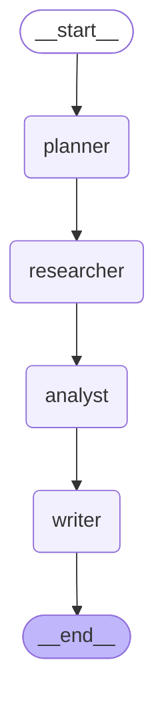
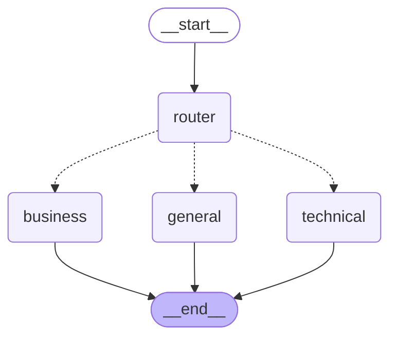
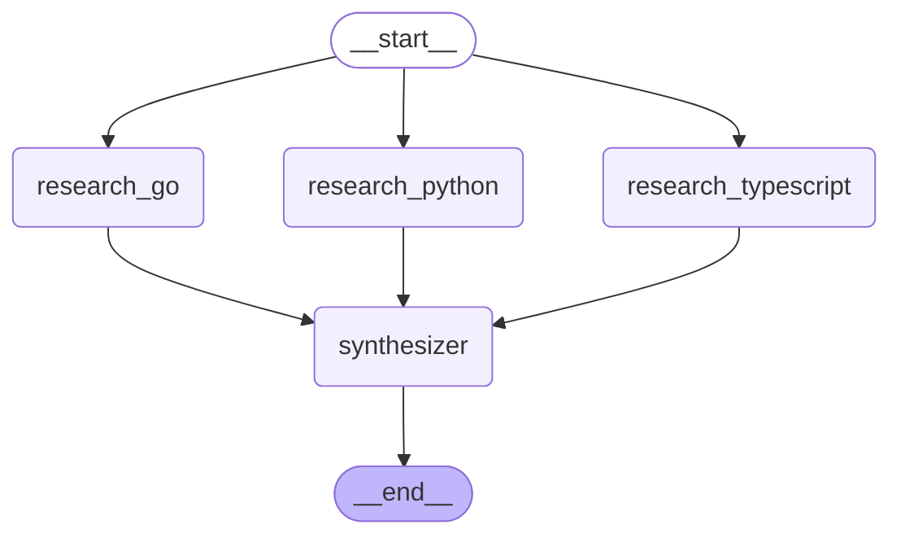
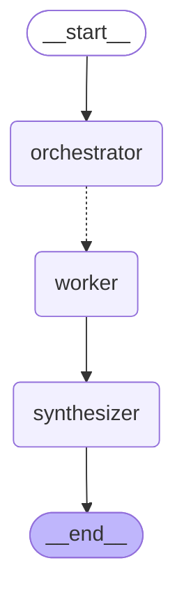
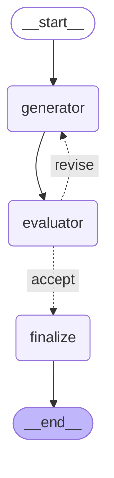

# 06 - 用 LangGraph 表达 Anthropic 的五种 Agent Pattern

对应代码：

```
src/patterns/
├── __init__.py
├── prompt_chaining.py
├── routing.py
├── parallelization.py
├── orchestrator_workers.py
└── evaluator_optimizer.py
```

对应测试：

```
tests/patterns/
├── test_prompt_chaining_pattern.py
├── test_routing_pattern.py
├── test_parallelization_pattern.py
├── test_orchestrator_workers_pattern.py
└── test_evaluator_optimizer_pattern.py
```

本文档参考 Anthropic 的文章 *Building Effective Agents* 中定义的五种基础
workflow pattern，逐一用 LangGraph 的 `StateGraph` 重新表达，并与仓库中
已有的、基于 OpenAI Agents SDK 的参考实现（`src/routing.py`、
`src/parallelization.py`、`src/orchestrator_workers.py`、
`src/evaluator_optimizer.py`）保持行为语义一致（例如 `MAX_WORKERS`、
`PASS_SCORE`、`MAX_ITERATIONS` 等硬编码上限均沿用原实现）。

所有 5 个模块都：

* 使用 `StateGraph` + 明确的 `TypedDict` State。
* Node 是纯函数，通过工厂函数（如 `make_planner(llm_call)`）注入
  LLM/Tool 调用，不直接依赖任何 Agent SDK/abstraction。
* 提供 `build_graph(...)` 返回 `compile()` 后的图，以及
  `get_mermaid(graph)` 返回 Mermaid 源码。
* 完全可离线测试：测试中注入 fake LLM / fake `search_web`，不需要真实网络
  或 API Key。

---

## 1. Prompt Chaining（提示链）

**Anthropic 语义**：把一个任务拆成固定的、顺序执行的步骤，每一步的 LLM
调用只依赖上一步的输出。步骤顺序在设计时就已确定，不需要运行时决策。

**Graph**：

```
START -> planner -> researcher -> analyst -> writer -> END
```



**State**（`PromptChainState`）：`question` / `dimensions` /
`research_notes` / `analysis` / `final_answer`。每个 Node 只写自己负责的
字段，与实验 2（`02_state.py`）的原则一致。

**Node**：`planner`（拆解研究维度）→ `researcher`（对每个维度调用
`search_web` 并总结）→ `analyst`（对比分析）→ `writer`（生成最终答案）。

**Edge**：全部是普通 `add_edge`，没有 Conditional Edge——因为步骤顺序
永远不变，不需要运行时判断走向。

---

## 2. Routing（路由）

**Anthropic 语义**：用一个分类步骤判断输入属于哪一类，然后程序代码把它
分发给恰好一个专门处理该类别的下游步骤；其余分支完全不会执行。

**Graph**：

```
START -> router --"technical"--> technical --> END
              --"business"-->  business  --> END
              --"general"-->   general   --> END
```



**State**（`RoutingState`）：`question` / `category` / `final_answer`。

**Node**：`router`（只写 `category`）+ 三个专家 Node
`technical`/`business`/`general`（只写 `final_answer`）。

**Conditional Edge**：`route_after_router(state) -> Category` 读取
`router` 写入的 `category`，通过 `add_conditional_edges` 精确路由到唯一
一个专家 Node。测试 `test_only_the_chosen_specialist_runs` 验证了未被
选中的两个专家 Node 完全不会执行。

---

## 3. Parallelization（并行化 / 分区）

**Anthropic 语义**：把一个可以独立拆分的任务，拆成固定数量、互不重叠的
子任务，**同时**执行，再由一个 Synthesizer 汇总所有子任务的结果。

**Graph**（从 START 静态 fan-out，到 synthesizer 自动 fan-in）：

```
START --> research_python      \
START --> research_typescript   --> synthesizer --> END
START --> research_go          /
```



**State**（`ParallelizationState`）：`question` /
`findings: Annotated[list[LanguageFindings], operator.add]` /
`final_answer`。

**为什么这里必须用 Reducer**：三个 `research_*` Node 之间没有数据依赖，
LangGraph 会把它们放进同一个 "superstep" 并发执行。它们都会往
`findings` 字段写入自己的结果。如果不加 `operator.add` 这个 Reducer，
LangGraph 默认的合并策略是"最后写入者胜出"（last write wins），三份
结果中有两份会被静默丢弃。加上 Reducer 后，三次写入会被自动拼接成一个
长度为 3 的列表，测试 `test_all_three_researchers_run_and_none_of_their_findings_are_lost`
验证了这一点。

**fan-in 是自动的**：不需要任何特殊 API——只要多条边指向同一个下游
Node（`synthesizer`），LangGraph 会自动等待所有上游分支都执行完毕后，
才触发下游 Node，这就是"自动 join"。

---

## 4. Orchestrator-Workers（协调者-工作者）

**Anthropic 语义**：一个中心 LLM（Orchestrator）在运行时动态地把任务拆
成数量不固定的子任务，为每个子任务派发一个 Worker（并发执行），最后由
Synthesizer 汇总所有 Worker 的结果。和 Parallelization 的关键区别是：
子任务的**数量**和**内容**都是运行时决定的，不是设计时写死的。

**Graph**：

```
START -> orchestrator -> assign_workers(routing fn, 返回 N 个 Send)
                              |
                              v
                           worker  (每个任务一次调用，全部并发)
                              |
                              v
                          synthesizer -> END
```



**State**（`OrchestratorWorkersState`）：`question` / `tasks` /
`worker_results: Annotated[list[WorkerResult], operator.add]` /
`final_answer`；每次动态派发的 `worker` 调用只看到一个精简的
`WorkerInput{task}`，看不到其它任务。

**动态 fan-out（`Send`）**：`assign_workers` 不是普通的路由函数（返回
固定字符串），而是通过 `from langgraph.types import Send` 返回一个列表
`[Send("worker", {"task": t}) for t in tasks]`。列表长度等于
Orchestrator 生成的任务数量——这是运行时才能确定的数字。
`add_conditional_edges("orchestrator", assign_workers, ["worker"])`
把这个动态列表注册成条件边。测试
`test_dynamic_task_count_drives_the_same_number_of_worker_results` 验证
了任务数从 1 到 `MAX_WORKERS` 变化时，`worker` 都会被恰好调用相应次数，
且 `worker_results`（借助 Reducer）不会丢失任何一条结果。

**硬编码上限**：与原实现一致，`MAX_WORKERS = 5` 在代码里强制校验
（`_parse_tasks` 中直接 `raise ValueError`），不完全信任模型自己遵守
prompt 里的数量要求。

---

## 5. Evaluator-Optimizer（评估-优化）

**Anthropic 语义**：一个 Generator 生成草稿，一个独立的 Evaluator 按固定
标准打分/给反馈；如果不合格，反馈被喂回 Generator 进行修订，如此循环，
直到分数达标或触发硬性迭代上限。

**Graph**：

```
START -> generator -> evaluator -> should_revise --"revise"--> generator（回到循环）
                                                  `-"accept"--> finalize -> END
```



**State**（`EvaluatorOptimizerState`）：`question` / `draft` /
`feedback` / `score` / `iteration` / `best_draft` / `best_score` /
`final_answer`。

**Node**：`generator`（只写 `draft`、`iteration`，收到反馈时基于反馈
修订而不是从零重写）；`evaluator`（只写 `score`、`feedback`，以及在分数
刷新时更新 `best_draft`/`best_score`——评估者本身**从不**改写草稿）；
`finalize`（只写 `final_answer` = 历史最高分的草稿，不一定是最后一次
草稿）。

**Conditional Edge（循环）**：`should_revise` 依据代码里写死的
`PASS_SCORE = 8` 和 `MAX_ITERATIONS = 3` 做决策——分数达标，或者
迭代次数已达上限（即使分数仍不合格），都会强制走向 `"accept"` ->
`finalize`；否则走 `"revise"` 回到 `generator` 继续修订。这个循环由
`add_conditional_edges("evaluator", should_revise, {...})` 实现，
`"revise"` 分支指回 `generator`，形成图中的环。测试
`test_max_iterations_cap_stops_a_never_passing_draft` 验证了即使
Evaluator 一直打低分，循环也会在第 3 轮被强制终止。

---

## 对照表：Anthropic Pattern → LangGraph 概念

| Anthropic Pattern       | LangGraph Node                                              | LangGraph Edge                                  | LangGraph State                                                              | LangGraph Conditional Edge                                                      |
|-------------------------|--------------------------------------------------------------|--------------------------------------------------|-------------------------------------------------------------------------------|-----------------------------------------------------------------------------------|
| Prompt Chaining          | `planner` / `researcher` / `analyst` / `writer`              | 4 条固定顺序的 `add_edge`                          | `PromptChainState`：每个字段恰好被一个 Node 写入                              | 不需要——顺序在设计时已确定                                                          |
| Routing                  | `router` + `technical`/`business`/`general`（三选一执行）      | `START->router`，三个专家各自 `->END`               | `RoutingState.category` 是路由依据，`final_answer` 由被选中的专家写入          | `route_after_router`：读取 `category`，静态三选一                                    |
| Parallelization          | `research_python`/`research_typescript`/`research_go` + `synthesizer` | `START` 同时指向 3 个 Node（静态 fan-out），3 个 Node 都指向 `synthesizer`（自动 fan-in） | `findings: Annotated[list[...], operator.add]`——**必须**用 Reducer 合并并发写入 | 不需要——分支数量固定为 3，无需运行时判断                                              |
| Orchestrator-Workers     | `orchestrator` / `worker`（动态调用 N 次）/ `synthesizer`       | `orchestrator -> worker` 是动态条件边，`worker -> synthesizer` 固定 | `tasks`（运行时决定长度）；`worker_results: Annotated[list[...], operator.add]` | `assign_workers` 返回 `list[Send(...)]`——**动态数量**的 fan-out，而非固定分支名     |
| Evaluator-Optimizer      | `generator` / `evaluator` / `finalize`                        | `generator -> evaluator` 固定；`evaluator -> generator` 由条件边构成循环 | `score`/`feedback` 驱动决策；`best_draft`/`best_score` 跨迭代累积（非并发，用普通字段即可） | `should_revise`：分数达标或迭代到上限 -> `"accept"`，否则 -> `"revise"`（形成环）    |

---

## 为什么 LangGraph 非常适合表达 Anthropic Agent Patterns？

1. **统一的抽象覆盖全部五种模式**。Anthropic 的文章描述了五种"形状"
   完全不同的 workflow：线性链、分支路由、静态并行、动态并行、带反馈的
   循环。但在 LangGraph 里，它们全部只是同一个 `StateGraph` 上不同的
   Node/Edge 拓扑——不需要为每种模式引入不同的框架或不同的控制流写法。
   这让五种模式可以放进同一个 `src/patterns/` 目录，用完全一致的心智
   模型（State + Node + Edge）去理解和维护。

2. **Reducer 天然解决"并发写同一个字段"的问题**。Parallelization 和
   Orchestrator-Workers 都需要多个 Node 同时写入同一个列表字段。手写
   `asyncio.gather` 版本（如 `src/parallelization.py`）必须自己在代码里
   收集每个任务的返回值再拼接列表；LangGraph 只需在 State 定义时声明
   `Annotated[list[X], operator.add]`，合并逻辑就被框架自动处理，且这
   一行声明本身就是"这里存在并发写入"的文档。

3. **Conditional Edge 同时能表达"多选一路由"和"循环中的接受/拒绝"**。
   Routing 需要的是从 N 个选项里选 1 个固定分支；Evaluator-Optimizer
   需要的是"继续循环 or 退出循环"。这两种看似不同的控制流，在 LangGraph
   里都是同一个 API——`add_conditional_edges(node, routing_fn, mapping)`
   ——只是路由函数返回值的语义不同。不需要为"路由"和"循环"分别设计两套
   机制。

4. **`Send` API 让"运行时才知道数量"的 fan-out 变得声明式**。
   Orchestrator-Workers 模式中，子任务数量在编译期是未知的。原生 Python
   实现（`src/orchestrator_workers.py`）必须手写
   `asyncio.gather(*[worker(t) for t in tasks])` 这样的并发调度代码；
   LangGraph 用 `Send(node_name, partial_state)` 把"动态调用 N 次某个
   Node，并把结果通过 Reducer 自动合并回主 State"这件事，压缩成一个
   路由函数里的一行 list comprehension，调度、并发、结果合并全部由框架
   负责。

5. **图结构本身就是可视化文档**。每个 pattern 模块都提供
   `get_mermaid(graph)`，同一套 `build_graph()` 代码可以直接生成
   Mermaid 图——这意味着"代码即架构图"，五种模式的差异（一条线 / 一次
   分叉 / 静态并行 / 动态并行 / 带环的循环）在图上一眼就能看出来，比阅读
   `if/else`、`while`、`asyncio.gather` 混杂的手写控制流更直观，也更容易
   在代码评审中对齐设计意图。

6. **State 的显式 Schema 强制"数据契约"清晰**。每种模式各 Node 该读什么、
   写什么，都体现在 TypedDict 字段上，而不是散落在函数参数、闭包变量或
   隐式全局状态里（参见 `docs/02-STATE.md`）。这在多 Node/多分支的复杂
   workflow 中尤其重要：即使 Orchestrator-Workers 里 Worker 是被动态调用
   的，它的输入契约（`WorkerInput{task}`）依然是显式声明的类型，而不是
   一个临时拼凑的 dict。
