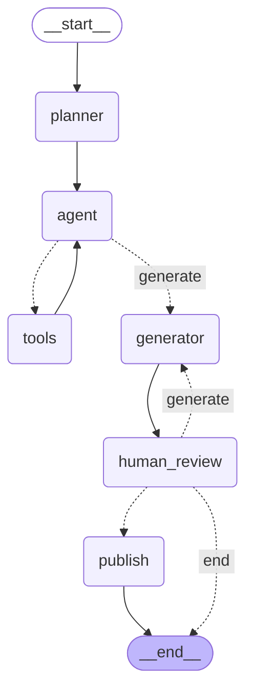

# 08 - LangGraph Human-in-the-loop

对应代码：`src/08_human_in_loop.py`
对应测试：`tests/test_human_in_loop.py`

本实验在实验 7（Persistence）的 Research Agent 基础上，加入一个**高风险
Tool**：`publish_report(report)`。要求 Agent 在生成最终 Research Report
之后，**绝不允许直接发布**，必须暂停并交给人类审核。

## Graph

```
START
  |
  v
planner
  |
  v
agent  <---------------------.
  |                          |
  v                          |
should_continue               |
  |-- "tools" --> tools ------'
  `-- "generate" --> generator  <---------------.
                          |                      |
                          v                      |
                    human_review                 |
                          |                      |
                route_after_review                |
                   |-- "approve" --> publish --> END
                   |-- "reject"  --> END
                   `-- "request_changes" --------'
```



## 各 Node 职责

* `planner` / `agent` / `tools`：与实验 5、7 完全一致的研究循环
  （Agent Loop 通过 Conditional Edge `should_continue` 表达）。
* `generator`：只负责起草（或根据人类反馈修订）Research Report，写入
  `report` 字段。它**从不**决定报告能否发布。
* `human_review`：唯一能够真正"暂停"图执行的 Node。内部调用
  `langgraph.types.interrupt(payload)`，把草稿报告和问题一并交给人类，
  自己不往下走，直到收到 resume 的决定。只写 `review_decision`（以及
  `request_changes` 时追加 `review_feedback`）。
* `publish`：真正调用高风险 Tool `publish_report(report)` 的地方。图里
  **唯一** 能进入 `publish` 的路径是 `route_after_review` 返回
  `"approve"` 这一条边——没有任何其它 Node 直接连到它。

## 三种审核结果

`route_after_review(state)` 读取 `human_review` 写入的 `review_decision`：

| 决定 | 行为 |
|---|---|
| `approve` | 路由到 `publish`，调用高风险 Tool，写 `published=True`、`final_answer=report`，然后 `END` |
| `reject` | 直接路由到 `END`，`publish` 永远不会被调用，报告被丢弃 |
| `request_changes` | 把人类的 `comments` 追加进 `review_feedback`，路由回 `generator`，让它据此修订报告，随后再次进入 `human_review` |

`tests/test_human_in_loop.py` 分别验证了这三条路径，以及
`request_changes` 可以反复多轮、每轮反馈都被正确累积，还有一个"未知决定
必须报错"的防御性测试（不能悄悄放行陌生输入）。

## 关键代码：`interrupt()` + `Command(resume=...)`

```python
def human_review(state):
    decision_input = interrupt({
        "kind": "publish_report_approval",
        "question": state["question"],
        "report": state["report"],
        "review_round": len(state["review_feedback"]),
    })
    decision = decision_input["decision"]
    ...

# 第一次调用：跑到 human_review 就暂停
result = graph.invoke(initial_state(question), config=config)

# 人类给出决定后恢复执行
result = graph.invoke(Command(resume={"decision": "approve"}), config=config)
```

`interrupt(payload)` 是 LangGraph "**动态中断**"（相对实验 7 里静态的
`interrupt_before=[...]`）：暂停位置不是编译期写死的一个 Node 名，而是
可以出现在 Node 函数内部任意一行代码处，且可以携带任意 payload 给外部
消费。

---

## 重点问题解答

### 1. `interrupt` 为什么需要 persistence？

`interrupt()` 的语义是"**执行到这里，先别往下走，把控制权交还给调用
者**"。但图不能真的停在内存里等着——一次 `invoke()` 调用返回后，Python
进程里那次函数调用的调用栈、局部变量全部消失了。如果没有 checkpointer，
`interrupt()` 触发时,当前 Node 执行到一半的这份 State 根本没有地方可以
存放，等到未来某个时刻人类做出决定时，程序完全不知道"从哪儿接着跑"。

实测验证（`PersistenceRequirementTest`）：不带 checkpointer 编译图，
`invoke()` 并不会报错，而是**默默地**在 `human_review` 处"卡住"——返回的
State 里 `review_decision` 还是 `None`、`published` 还是 `False`，之后
再想读取或恢复，`get_state()` 会直接抛 `ValueError("No checkpointer
set")`。也就是说：没有 persistence，中断这件事**发生了但是没有被记录**，
本质上等于这次审批请求永远丢失了，无法被任何人恢复。所以
Interrupt + Persistence + Resume 必须是一个不可分割的三件套：
persistence 是 interrupt 能够被"看见并恢复"的前提。

### 2. Graph 暂停后，State 在哪里？

暂停发生的那一刻，LangGraph 已经把"当前 super-step 执行前"的完整
`State` 写入了 checkpointer（本实验用的是实验 7 同款的
`InMemorySaver`，数据存在进程内存的一个字典里，按 `thread_id` 分区）。
可以用 `graph.get_state(config)` 把它读出来看：

* `state.values`：此刻的完整 State（例如 `report` 已经是 `generator`
  写好的草稿，`review_decision` 还是 `None`）。
* `state.next`：还没跑完的 Node，此时是 `("human_review",)`，说明图正
  卡在进入 `human_review` 之后、还没跑完这个 Node 的地方。
* `state.tasks[0].interrupts`：本次中断的详细信息，包含 `interrupt()`
  调用时传入的那个 payload（本实验里就是
  `{"kind": ..., "report": ..., "question": ...}`），可以直接展示给
  人类审核界面用。

换句话说：暂停后 State 既**不在**内存里的某个 Python 变量中，也**不在**
调用者的调用栈里，而是完整地存在 checkpointer 那份存储里，可以在任意
之后的时间点、任意进程里被重新读取。

### 3. resume 是怎么工作的？

`graph.invoke(Command(resume=<value>), config=config)`——用同一个
`thread_id` 的 `config`，把 `Command(resume=...)` 作为"输入"传进去
（而不是传一份新的 State）。LangGraph 看到 `Command(resume=...)` 后：

1. 用 `thread_id` 从 checkpointer 里取出最近一次保存的 checkpoint
   （即暂停时的 State）。
2. 找到当时因为 `interrupt()` 而被打断的那个 Node（`human_review`），
   **从这个 Node 函数的最开始重新执行它**（这是需要特别注意的一点：
   本实验的沙盒验证证实，`interrupt()` 之前的代码会被重新跑一遍;
   `interrupt()` 这次不再暂停，而是直接返回 `resume` 携带的值）。
3. `human_review` 函数拿到 `decision_input = {"decision": "approve",
   ...}` 后继续往下执行，返回它的 State 更新（`review_decision` 等）。
4. 图从这里正常按 Conditional Edge 继续往下走（`publish`/`END`/
   `generator`），不会重新跑 `planner`/`agent`/`tools` 这些早就完成的
   Node——它们的 Checkpoint 已经存在，不需要重算。

所以"resume"本质上是"用同一个 thread_id 再调用一次
`invoke`，但输入换成一个特殊的 `Command` 信号，触发 LangGraph 从最近的
中断点继续调度剩余的图"，而不是常规意义上"传入新数据重新算一遍"。

### 4. 为什么传统 `while` loop 实现这种能力比较麻烦？

如果用手写的 `while True: ...` 循环去实现同样的 Human-in-the-loop：

* **暂停点必须手动切开成两个进程/两次调用**。`input()` 式的阻塞等待在
  真实服务里不可行（用户可能几小时后才审批），所以必须把状态手动序列化
  （`report`、`plan`、`messages`、已经做了几步、已经攒了哪些搜索结果...）
  存到某个自己维护的字典/数据库表里，并且要自己发明一套"续跑"的逻辑：
  重新构造循环变量、跳到正确的 `if` 分支、恢复上一轮的所有中间变量。
* **每加一个可能暂停的位置，都要重新设计一遍序列化格式和恢复逻辑**。
  比如今天只在"发布前"暂停，明天还想在"搜索前"也暂停一次，用 `while`
  写就要再手写一套"保存/恢复到搜索前状态"的代码，很容易出现遗漏字段、
  恢复到错误分支等 bug。
* **多用户/多任务并发时容易状态串号**。`while` 循环里的局部变量默认就是
  当前这一个任务的，一旦需要支持多个用户同时各自等待审批，就必须自己
  发明类似 `thread_id` 的机制去给每个任务的挂起状态做隔离存储、加锁、
  防止读写冲突。
* **调试与观测困难**。想知道"某个任务现在卡在哪一步、State 是什么"，
  在手写方案里往往要专门写查询代码去解析自己存的那份序列化数据；而
  LangGraph 里这就是 `get_state()`/`get_state_history()` 两个通用 API,
  对任何图都适用。

LangGraph 把"暂停点在哪、暂停时状态如何序列化、如何按 thread 隔离、如何
从暂停点精确恢复"这些工程细节都收敛成了 `interrupt()` + `checkpointer`
+ `Command(resume=...)` 三个统一、可复用的原语，业务代码只需要在需要暂停
的地方调用一次 `interrupt(payload)`，其余的持久化、恢复、隔离全部由框架
负责。

### 5. LangGraph 在 Agent Runtime 中解决了什么问题？

把本实验和前面几个实验串起来看，LangGraph 对"运行一个多步骤 Agent"这件
事，统一解决了几类原本要各自手写、且容易出错的运行时问题：

* **执行状态的显式建模**（实验 2）：State 是什么、每步该改哪个字段，是
  显式 Schema，而不是散落在闭包变量里。
* **控制流的声明式表达**（实验 3/4）：顺序执行、条件路由、循环，都是图
  的边，而不是嵌套的 `if`/`while`。
* **并发写入的正确合并**（Patterns 里的 Parallelization/
  Orchestrator-Workers）：Reducer 解决多路并发写同一个字段的问题。
* **执行状态的持久化与恢复**（实验 7）：Checkpointer + Thread ID 解决
  "任务能不能中断后继续、多个任务之间状态会不会串"的问题。
* **人类介入的暂停点**（本实验）：`interrupt()` 解决"图在关键决策点必须
  等待外部输入才能继续"的问题，而且这个暂停点可以出现在任意 Node 内部
  任意位置，不需要在编译期提前规划所有可能的暂停位置。

综合起来，LangGraph 提供的是一个**通用的 Agent Runtime**：开发者只需要
定义 State、Node、Edge（以及必要时的 Reducer 和中断点），剩下的"怎么
调度执行、怎么保存/恢复状态、怎么隔离并发任务、怎么处理人类介入"，全部
由这同一套引擎统一负责，而不需要为每一个新的 Agent 都重新发明一套
运行时基础设施。
