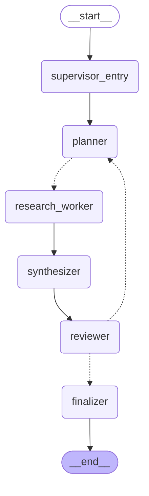

# Multi-Agent Research System（阶段最终项目）

## 0. 架构

```
User
  │
  ▼
Supervisor (supervisor_entry)     —— 整体协调，记录 trace，不做任何 LLM 调用
  │
  ▼
Planner                           —— 动态拆分 Research Tasks（不写死）
  │
  ▼ (conditional edge 返回 list[Send]，fan-out)
Research Worker × N               —— 并行的 Specialist Research Agents，
  │                                   每个只负责一个独立 Task
  ▼ (LangGraph 等待所有已派发的 Worker 完成，fan-in)
Synthesizer                       —— 整合所有 Research Results
  │
  ▼
Reviewer                          —— 检查 completeness / factual consistency /
  │                                   evidence quality / logical consistency /
  │                                   missing important aspects
  ▼ (条件边)
  ├── FAIL（未通过）且 iteration < max_iterations ──▶ 回到 Planner（针对缺口重新研究）
  │
  ▼ PASS，或 iteration 预算耗尽
Supervisor (finalizer)            —— 生成 Final Answer
  │
  ▼
END
```

Mermaid（`graph.get_graph().draw_mermaid()` 真实输出）：



代码：`src/multi_agent_research/{state,planner,research_worker,synthesizer,reviewer,graph,main}.py`
测试：`tests/multi_agent_research/{test_planner,test_workers,test_reviewer,test_graph}.py`
（42 个，全部离线，使用可注入的假 `TextLLMCall`，不需要网络/API Key）

这是本阶段前五个实验的一次综合落地：Specialist Agents（实验 1）+ Dynamic Fan-out/Fan-in
Parallel Research（实验 4）+ Shared State + 循环重试（实验 5），组合成一个真正端到端、
可靠、可追踪的 Multi-Agent Research 系统。没有用到 Handoff（实验 2）或
Agents-as-Tools/Supervisor 模式（实验 3）的 SDK 机制——这里的"Supervisor"是一组围绕
LLM Agent 的确定性协调节点，不是一个会调用其他 Agent 当 Tool 的 LLM。

## 为什么没有单独的 `supervisor.py`

按需求文件清单，`src/multi_agent_research/` 下没有 `supervisor.py`。这不是遗漏，而是设计选择：
Supervisor 在这个系统里的职责——"协调整体任务、决定何时收尾"——恰好就是 `graph.py` 里
`StateGraph` 本身的编排逻辑 + 两个很薄的确定性节点（`supervisor_entry` 入口、`finalizer` 出口）
在做的事情。它不需要自己的 LLM 调用、不需要独立的 instructions，所以没有必要单独成为一个
"Agent 文件"——它就是图的骨架本身。详见问题 3/4 的进一步讨论。

## `MultiAgentResearchState` 定义（`state.py`）

```python
class ResearchTask(TypedDict):
    task_id: str
    aspect: str
    reason: str          # 例如 "initial decomposition" 或 "gap-filling for iteration 2"

class WorkerResult(TypedDict):        # structured worker result
    task_id: str
    aspect: str
    status: Literal["completed", "timeout", "failed"]
    findings: str
    error: Optional[str]

class ReviewVerdict(TypedDict):
    approved: bool
    completeness: str
    factual_consistency: str
    evidence_quality: str
    logical_consistency: str
    missing_aspects: list[str]
    feedback: str

class MultiAgentResearchState(TypedDict):   # structured state
    question: str
    tasks: list[ResearchTask]
    worker_results: Annotated[list[WorkerResult], operator.add]   # fan-in reducer
    synthesis: str
    review: ReviewVerdict
    final_answer: str
    iteration: int
    max_iterations: int
    max_workers: int
    per_worker_timeout_seconds: float
    trace: Annotated[list[str], operator.add]                     # append-only 审计日志
```

字段所有权（每个节点只写自己的字段，读取需要的其他字段）：

| 节点 | 只写（owns） | 会读取 |
|---|---|---|
| `supervisor_entry` | `trace` | `question` |
| `planner` | `tasks`、`iteration`、`trace` | `question`、`max_workers`、（重试时）`review` |
| `research_worker`（并行 fan-out） | `worker_results`（reducer 累加）、`trace` | 只有自己的 `task`（通过 `Send` payload） |
| `synthesizer` | `synthesis`、`trace` | `worker_results`（全部累计结果） |
| `reviewer` | `review`、`trace` | `question`、`synthesis` |
| `finalizer` | `final_answer`、`trace` | `synthesis`、`review`、`iteration` |

## Reliability（可靠性）机制

- **最大 Worker 数量**：`Planner` 里 `capped = aspects[:state["max_workers"]]`，不管 LLM 提出
  多少个方面，只有前 `max_workers`（默认 6）个会变成实际的 `Send` 派发。
- **最大 Review Iterations**：`route_after_review` 在 `state["iteration"] >= state["max_iterations"]`
  （默认 3）时强制转到 `finalizer`，不管 Review 是否通过。
- **Worker timeout**：`research_worker.py` 里的 `_run_with_timeout` 用
  `threading.Thread(daemon=True)` + `thread.join(timeout)` 强制每个 Worker 的 LLM 调用
  不超过 `per_worker_timeout_seconds`（默认 30s）。**特意不用**
  `concurrent.futures.ThreadPoolExecutor`：该模块会给它创建过的每一个线程注册一个全局
  `atexit` 钩子，在解释器退出前 join 所有这些线程——哪怕某个 executor 已经被
  `shutdown(wait=False)`。这意味着一个真实的、超过自己超时预算仍在后台挂起的网络请求，
  依然会拖住整个进程退出（这是实验 4 里真实跑通后才发现、并修复的 bug；详见
  `docs/04-PARALLEL-MULTI-AGENT.md`）。daemon 线程没有这个问题：进程退出时它会被系统直接回收。
- **Worker failure handling**：`research_worker` 节点内部用 `try/except` 捕获**任何**异常
  （包括超时），转换成 `status="timeout"/"failed"` 的 `WorkerResult`，**从不向外抛出异常**——
  因为一个未捕获的异常会让整个 `graph.invoke()` 崩溃，连累其他仍在运行的并行分支
  （实验 4 里已经用独立脚本验证过这一点）。
- **structured state / structured worker result**：全系统只有一种通信介质——上面定义的
  `TypedDict`，没有任何节点传递自由格式的字符串或字典。

## 真实跑通发现的一个 bug：`metadata.get("writes", {})` 的陷阱

`main.py` 最初用 `snapshot.metadata.get("writes", {}).keys()` 打印每一步的状态历史。这在离线
测试里（结构简单的假 state）没有暴露问题，但在真实端到端运行时，`get_state_history` 返回的
最早一个快照（`step=-1`，对应"输入尚未被任何节点处理"的那一刻）的 `metadata["writes"]`
**键存在但值就是 `None`**——`dict.get(key, default)` 的 `default` 只在键**不存在**时生效，
键存在但值为 `None` 时仍然返回 `None`，导致 `.keys()` 报 `AttributeError`。
修复：`(snapshot.metadata.get("writes") or {}).keys()`。这是一个很典型的"离线测试覆盖不到、
只有跑真实 checkpointer 历史才会暴露"的边界情况，也是坚持做真实端到端验证（而不是只信任
离线单测）的价值所在。

## 一次完整运行的 Trace / Execution Log

以下是用真实 OpenAI API 跑通该系统的（节选、清理过多余细节的）真实 trace，问题为：
**"2026 年 AI Agent 开发生态有哪些值得 Solo Developer 关注的机会？"**

```
Supervisor: received question='2026 年 AI Agent 开发生态有哪些值得 Solo Developer 关注的机会？'
            (max_workers=6, max_iterations=3, per_worker_timeout_seconds=30.0)
Supervisor: coordinating research for question=...
Planner: iteration 1 produced 6 task(s) (initial decomposition)
ResearchWorker[iter1-task0-...]: status=timeout  aspect='Agent 框架的启动与响应延时'
ResearchWorker[iter1-task1-...]: status=timeout  aspect='多智能体协作机制'
ResearchWorker[iter1-task2-...]: status=timeout  aspect='Agent 协议与互操作'
ResearchWorker[iter1-task3-...]: status=timeout  aspect='垂直行业Agent应用'
ResearchWorker[iter1-task4-...]: status=timeout  aspect='评估与安全Agent'
ResearchWorker[iter1-task5-...]: status=timeout  aspect='商业化与自动化'
Synthesizer: synthesized 6 accumulated worker result(s)
Reviewer: iteration 1 approved=False
          missing_aspects=['2026 年 AI Agent 市场与技术格局（主流模型、成本变化、竞争格局）',
                            '主流 Agent 框架、开发时间、平台与托管方案的横向比较', ...]
Planner: iteration 2 produced 6 task(s) (gap-filling for iteration 2 (Reviewer feedback))
ResearchWorker[iter2-task0-...]: status=timeout    aspect='...'
ResearchWorker[iter2-task4-...]: status=completed  aspect='...商业模式与可持续经营...'
Synthesizer: synthesized 12 accumulated worker result(s)
Reviewer: iteration 2 approved=False  missing_aspects=[...11 项...]
Planner: iteration 3 produced 6 task(s) (gap-filling for iteration 3 (Reviewer feedback))
ResearchWorker[iter3-task0..5]: status=timeout（5 个）/ completed（1 个）
Synthesizer: synthesized 18 accumulated worker result(s)
Reviewer: iteration 3 approved=False  missing_aspects=[...12 项...]
Supervisor: finalized answer (approved=False)

FINAL_ANSWER:
<synthesizer 产出的最新综述文本>
[Review: NOT approved after 3 iteration(s) (max_iterations=3); delivering best-effort answer.
 Outstanding feedback: 需要将候选机会收敛到小范围的 5~8 个候选方向，...]

STATE HISTORY (checkpointer)：
step=-1 writes=['__start__']
step=0  writes=[]
step=1  writes=['supervisor_entry']
step=2  writes=['planner']
step=3  writes=['research_worker']    # 6 个并行实例合并为一条记录
step=4  writes=['synthesizer']
step=5  writes=['reviewer']
step=6  writes=['planner']            # 第 2 轮
...
step=N  writes=['finalizer']
```

这次真实运行里，默认 30 秒的单 Worker 超时对当时使用的模型来说偏紧（大部分方面的研究耗时
超过 30 秒），导致多数 Worker 以 `timeout` 收场——这本身是一次很有价值的可靠性验证：

1. **超时机制按预期生效**：没有任何一次调用无限期挂起，每个 Worker 都在 30 秒左右返回；
2. **单个/多个 Worker 失败不影响整体**：即使 5/6 的 Worker 超时，`Synthesizer` 依然正常运行，
   只是如实标注了"未能完成的研究项"；
3. **Reviewer 的反馈驱动了真实的迭代改进**：`missing_aspects`/`feedback` 在每一轮之间确实发生
   变化（更聚焦、更具体），说明 Planner 确实在"针对性补研究"而不是简单重复；
4. **最大循环次数保护生效**：一个标准很严格、连续 3 轮都不满意的真实 Reviewer，也没有让系统
   无限循环下去——第 3 轮结束后系统直接进入 `finalizer`，交付一个明确标注"未通过、附带原因"
   的 best-effort 答案，而不是卡住不返回。

用更宽松的超时（60s）重跑同一个问题，Worker 的 `completed` 比例明显提高，但这个真实、严格的
Reviewer 依然在 3 轮内保持"不通过"（它对"5~8 个收敛后的具体机会 + 逐条可验证证据"的要求很高）——
这恰恰印证了 Requirement "最多 3 次" 的必要性：一个足够苛刻的审阅标准，如果没有硬性的循环上限，
理论上可以无限期地要求"更完整、更精确"。

（离线测试 `tests/multi_agent_research/test_graph.py::PersistenceTest` 用假 LLM 复现了同样的
`get_state_history` 结构：`supervisor_entry → planner → research_worker → synthesizer →
reviewer → finalizer`，证明这不是运气，而是图结构决定的确定性行为。）

## 问题解答

### 1. 为什么这个系统需要 Multi-Agent？

这个任务天然可以分解成**性质完全不同的子问题**，每一种都需要不同的"认知模式"：

- 拆解问题、决定研究什么——需要"规划"能力；
- 针对一个具体方面深入调查——需要"专注、聚焦"的调查能力，而且这类任务**天然可并行**；
- 把多份互相独立的调查结果整合成连贯叙述——需要"综合、组织信息"的能力；
- 挑出完整性、事实一致性、证据质量、逻辑一致性等方面的问题——需要"批判性审阅"的能力，
  而且审阅者不应该被自己刚写的内容"带偏"（这也是为什么审阅要交给一个独立视角）。

用一个 Agent 身兼四职，等于让同一次 LLM 调用在"发散地规划"和"收敛地批判"之间来回切换角色，
这两种模式的 prompt 目标本身就有张力（规划需要发散、审阅需要挑剔）。拆成多个 Agent 之后，
每个 Agent 的 instructions 可以做到单一、聚焦、无冲突，而且**并行执行**这件事本身也要求
"多个独立运行的 Agent 实例"（而不是一个 Agent 循环调用自己 N 次）——这是 Multi-Agent 在这里
不可替代的另一半理由：Research Worker 的并行性依赖于它们是相互独立、可以同时存在的 Agent 实例。

### 2. 如果改成 Single Agent，会发生什么？

把 Planner/Worker/Synthesizer/Reviewer 全部压缩成一个 Agent，用一段很长的 instructions 让它
自己完成"拆解 → 逐一研究 → 整合 → 自我审阅 → 需要的话重新研究"，会有这些具体问题：

1. **失去真正的并行性**：一个 LLM 调用是单一的生成过程，"逐一研究"在技术上只能是**顺序**
   进行（一次调用里依次写完方面 A、B、C 的内容），无法真正并行——总耗时约等于所有方面耗时
   之和，而不是最长那个方面的耗时。
2. **自我审阅的可信度低**：让同一次生成"写完之后自己挑自己的错"，模型倾向于确认自己刚才的
   输出是对的（自我一致性偏差），缺少一个"独立视角"去真正挑刺——这也是为什么本系统的
   Reviewer 是一次**独立的、只看最终综述、不知道自己是不是原作者**的调用。
3. **超时/失败粒度太粗**：单 Agent 一次调用要么全部完成、要么整体失败/超时——没办法说
   "某个方面失败了，其他方面正常，只重跑失败的那个"。本系统里一个 Worker 超时只影响它自己
   那一条 `WorkerResult`，其余结果完好无损。
4. **Prompt 复杂度爆炸、行为难预测**：把"拆解逻辑 + 研究方法论 + 写作整合规范 + 审阅标准 +
   重试策略"全部塞进一份 instructions，模型更容易在长 instructions 中"跑题"或"遗漏某条规则"，
   也更难调试——出问题时无法定位是"拆解"环节还是"审阅"环节出了错。
5. **循环控制变得脆弱**：Single Agent 如果要自己决定"要不要再研究一轮"，这个决定和执行都在
   同一次不透明的生成过程里，没有本系统这种可由外部代码（`route_after_review`）强制介入、
   可断言、可测试的循环终止条件。

### 3. 哪些 Agent 可以合并？

- **Synthesizer 和 Finalizer 可以合并**：`finalizer` 目前是一个确定性的、无 LLM 调用的节点，
  只是把 `synthesis` 加上一个说明性的 note 包装成 `final_answer`。如果不需要严格区分
  "综述是什么样"和"最终答案是什么样"，完全可以让 `Synthesizer` 直接产出 `final_answer`，
  省掉一次额外的 graph 跳转。本系统把它们分开，是为了让 `Supervisor` 明确拥有"给出最终判断
  （是否通过、要不要标注 best-effort）"这个动作，职责边界更清楚，但这不是严格必要的拆分。
- **Supervisor 的两个节点（`supervisor_entry`/`finalizer`）某种意义上"合并"在了 `graph.py`
  的编排逻辑里**（见上文"为什么没有单独的 supervisor.py"）——它们从一开始就不是独立的 LLM
  Agent，而是一个 Agent 概念在代码里的两个执行点。

### 4. 哪些 Agent 必须保持独立？

- **Planner 和 Research Worker 必须独立**：Planner 的产出（任务列表）决定了 Worker 实例的
  数量和内容，如果合并，就无法做到"先动态决定要几个任务，再对每个任务并行分别调用"——
  这是并行 fan-out 结构本身要求的独立性。
- **Research Worker 之间必须互相独立**（这不是"能不能合并"的问题，而是设计的核心）：每个
  Worker 只研究一个方面，互相隔离，是并行、可单独超时/失败、结果互不影响的前提。
- **Reviewer 必须独立于 Synthesizer/Planner**：如果 Reviewer 和产出内容的 Agent 是同一个，
  批判的可信度就会下降（见问题 2）；而且 Reviewer 需要根据"是否通过"来决定是否触发新一轮
  Planner，这个决策权必须落在一个不参与生产内容的独立环节上，否则容易出现"既当运动员又当
  裁判"的自我合理化。

### 5. 哪些任务适合并行？

**Research Worker 阶段**——每个 Worker 研究一个独立的"方面"（aspect），彼此之间没有数据依赖：
Worker A 不需要知道 Worker B 研究到了什么，也不需要等 Worker B 完成才能开始。这正是本系统
用 LangGraph `Send` 做 fan-out 的地方，也是唯一真正并行执行的阶段。

### 6. 哪些任务存在依赖不能并行？

- **Planner 必须在 Research Worker 之前**：没有任务列表就没有 Worker 可以分派。
- **Synthesizer 必须在所有 Worker 完成之后**：它需要看到全部（或至少已经确定的最终）
  `worker_results` 才能产出连贯的综述——这也是为什么需要 fan-in（见问题 9 的呼应）。
- **Reviewer 必须在 Synthesizer 之后**：它审阅的对象是 `synthesis`，没有综述就无从审阅。
- **重新研究（Planner 第 2/3 轮）必须在 Reviewer 给出 `missing_aspects`/`feedback` 之后**：
  针对性补研究依赖上一轮的审阅结果，这是一个严格的顺序依赖，不能并行，也是为什么"审阅循环"
  被设计成一个串行的、有环的控制流，而不是像 Worker 阶段那样 fan-out。

### 7. Supervisor 和 Worker 如何通信？

**完全通过共享的 `MultiAgentResearchState`，不存在任何直接的函数调用或消息传递。**
`supervisor_entry`/`finalizer`（Supervisor 的两个执行点）和 `research_worker` 之间隔着
`planner`、`synthesizer`、`reviewer` 几层，彼此从未被对方直接调用：

- Supervisor（`finalizer`）读取的是 `synthesis`/`review`/`iteration`——都是 Worker 的产出
  经过 Synthesizer、Reviewer 两层加工之后的结果，Supervisor 从来不直接读取某一个 Worker 的
  原始 `WorkerResult`。
- Worker 也从不知道 Supervisor 的存在——它只从 `Send` payload 里拿到 `question`/`task`/
  `per_worker_timeout_seconds`，这几个字段是 `Planner` 准备好的，不是 Supervisor 直接给的。

这正是 Shared State 模式（实验 5）的延伸：Supervisor 对 Worker 的"协调"体现在**图结构本身**
（谁在什么条件下被调用）上，而不是运行时的消息传递上。

### 8. Shared State 如何设计？

延续实验 5 的原则，并加了两个新东西：

1. **每个字段都有唯一的"所有者"节点**（上文的所有权表格），其余节点只读不写——这一点在
   `tests/multi_agent_research/test_workers.py`/`test_reviewer.py`/`test_planner.py` 里都有
   "断言返回字典键集合"的自动化测试。
2. **`worker_results` 用 `operator.add` reducer，而不是覆盖写**：因为它同时承担两个职责——
   (a) 单次 fan-out 内多个并行 Worker 的 fan-in 合并，(b) 跨越多轮审阅循环的**累积**
   （第 2 轮的新结果不会抹掉第 1 轮已经研究好的内容，`Synthesizer` 每次都基于全部历史结果
   重新综述）。这是比实验 5 更进一步的地方：Shared State 不仅要在"一次 fan-out"内安全合并，
   还要在"跨越多次循环"的时间维度上安全累积。
3. **`trace` 是唯一"所有节点都可以写"的字段**，但每个节点只追加自己的一行，从不修改或删除
   别人的条目——这是"共享写权限"在保证安全前提下的唯一例外（审计日志天然需要所有参与者都能
   贡献，但"只追加、不覆盖"这个约束保证了它依然是安全的）。

### 9. 如何控制成本？

- **`max_workers` 硬上限**：无论 Planner 提出多少个研究方面，超出上限的部分直接被丢弃，
  从根本上限制了"这一轮"会产生多少次 LLM 调用。
- **`max_iterations` 硬上限**：限制了"最多重新研究几轮"，避免一个标准过于严苛的 Reviewer
  导致成本无限制地增长（本次真实运行就是这种情况的真实案例——如果没有这个上限，一个总是
  要求"更完整"的 Reviewer 理论上会让系统永远循环下去）。
- **针对性补研究，而不是每轮全量重跑**：`Planner` 在第 2/3 轮只针对 Reviewer 指出的具体缺口
  生成新任务（`PLANNER_REFINE_INSTRUCTIONS`），而不是把全部方面重新研究一遍——这是控制成本的
  关键设计：已经研究过、被认可的部分不需要重复付费重新生成。
- **失败/超时的 Worker 不会被无限重试**：一次超时就是一次 `status="timeout"` 的结果，
  不会自动触发指数退避式的自动重试（这个策略本身也是成本控制——真正的重试机会只留给
  Reviewer 判定确实需要的"下一轮"，而不是在同一轮里对同一个任务反复重试）。
- **可以进一步做的事**（本系统目前未实现，属于后续优化方向）：给不同角色配置不同价位的模型
  （例如 Worker 用更便宜的模型，Reviewer 用更贵但更可靠的模型）、对完全相同的 aspect 做
  结果缓存去重、限制单次 Worker 输出的最大 token 数。

### 10. 如何控制 latency？

- **并行 fan-out 是最大的一次性延迟优化**：N 个 Worker 并行执行，总耗时约等于最慢的那个
  Worker，而不是 N 个 Worker 耗时之和（实验 4/本系统都用真实的 sleep-based 测试验证过这一点）。
- **Worker 超时避免"一个慢请求拖累全局"**：`per_worker_timeout_seconds` 保证任何一个 Worker
  最多只占用这么多时间就必须交出结果（哪怕是失败结果），不会让整轮的 fan-in 无限期等待
  某一个卡住的请求。
- **循环上限同时也是延迟上限**：`max_iterations` 不仅控制成本，也直接限制了"最坏情况下这个
  系统会跑多久"——这是本系统里唯一的"整体延迟"控制手段（目前没有像实验 4 那样再加一层
  独立的、跨越整个 `graph.invoke()` 的总体 wall-clock 超时；如果需要，可以用与实验 4 相同的
  `_run_with_timeout` 包一层 `run_multi_agent_research` 本身，见下方"可以进一步做的事"）。
- **针对性补研究减少了每一轮的 Worker 数量**（通常第 2/3 轮的任务数会少于第 1 轮），
  间接降低了后续轮次的并行 fan-out 规模和耗时。
- **可以进一步做的事**：给 `run_multi_agent_research` 再包一层总体超时（模式与实验 4 完全
  一致）；对 Synthesizer/Reviewer 这类单次调用也考虑加超时保护，虽然不在本次 Requirement
  列表里，但原则相同。

### 11. 如何防止 Agent 无限循环？

**三层独立的保险**，任何一层单独就足够终止循环，叠加使用更稳妥：

1. **`max_iterations`（结构性上限）**：`route_after_review` 里显式检查
   `state["iteration"] >= state["max_iterations"]`，一旦达到就无条件转到 `finalizer`，
   不再关心 Reviewer 判定结果如何——这是**不依赖 LLM 自觉**的确定性代码保证。
2. **Planner 的输出永远受 `max_workers` 约束**：即使循环次数很多，每一轮产生的并行分支数
   也有硬上限，避免"循环次数没失控，但循环里的并行数量失控"这种变体问题。
3. **Worker 级别的超时**：确保循环内部的每一次实际调用本身也不会无限期挂起，即使
   `max_iterations` 逻辑本身工作正常，如果某个 Worker 卡住，整轮也会被拖慢——超时机制保证
   "循环的每一步"都有确定的时间上界，而不仅仅是"循环的次数"有上界。

三者结合，可以证明：整个 `graph.invoke()` 的最坏情况耗时是有限、可计算的上界
（`max_iterations × (max_workers × per_worker_timeout_seconds + Synthesizer/Reviewer 耗时)`
量级），不存在任何一条真正的无限循环路径。

### 12. 如何评估整个 Multi-Agent 系统？

可以从三个层次评估，本项目目前主要做到了前两层，第三层是后续优化方向：

1. **单元/契约层面（本项目已覆盖）**：
   - 每个节点的"所有权契约"是否成立（`OwnershipTest` 系列）；
   - 条件边的路由逻辑是否正确（`RouteAfterReviewTest`）；
   - 可靠性机制是否真的生效（超时测试、max_workers/max_iterations 断言测试、失败隔离测试）；
   - 并发是否真的发生（timing-based 测试）；
   - 持久化是否可用（`PersistenceTest`）。
   这一层回答的是"系统的工程实现是否符合设计"，与内容质量无关，可以完全离线、确定性地跑。
2. **端到端真实运行层面（本次已做，见上方 Trace）**：用真实 API 跑通至少一个真实问题，
   观察：Planner 产出的方面是否合理、Worker 的研究内容是否切题、Synthesizer 的整合是否连贯、
   Reviewer 的批评是否有的放矢（不是泛泛而谈）、循环是否真的因为 Reviewer 的具体反馈而改进、
   以及在达到 `max_iterations` 时系统是否体面地退出（给出明确标注的 best-effort 答案，而不是
   报错或卡死）。
3. **内容质量层面（本项目未实现，是自然的下一步）**：需要引入某种"评估者评估评估者"的机制，
   例如：
   - 人工或另一个独立 LLM 对 `final_answer` 按固定 rubric（是否可执行、是否有具体依据、
     是否覆盖用户真正关心的角度）打分；
   - 用一组"已知好答案"的历史问题做回归测试，追踪 `iteration` 次数、`approved` 比例、
     `final_answer` 的评分随着 prompt/模型迭代是否在改善；
   - 追踪成本指标（总 token 数、总耗时、平均 iteration 数）随时间的变化趋势，防止某次
     "改进" instructions 无意中让 Reviewer 变得更难取悦、从而系统性地推高成本和延迟。
   这一层需要脱离"这次跑通了没有报错"的判断，转向"这次的答案到底好不好、好了多少"，
   通常需要额外的评测数据集和评分标准，属于比本项目范围更靠后的阶段。

## 小结对照表（本系统 vs. 前置实验）

| 维度 | 实验 4（Parallel Multi-Agent） | 实验 5（Shared State） | 本系统（综合） |
|---|---|---|---|
| 任务拆分 | 动态、一次性 | 无（固定三步流水线） | 动态，且支持"针对性再拆分" |
| 并行 | 有（Worker fan-out/fan-in） | 无 | 有（Worker fan-out/fan-in） |
| 循环重试 | 无 | 有（Analysis↔Review，上限 3） | 有（Planner↔Reviewer，上限 3） |
| 审阅维度 | 无独立 Reviewer | 单一 approve/reject | 五个维度 + missing_aspects |
| 结果累积 | 不适用（单轮） | 不适用（单轮循环覆盖写） | 跨轮次累积（`operator.add`） |
| 持久化 | 无（Requirement 13 明确不用） | 有 | 有 |
