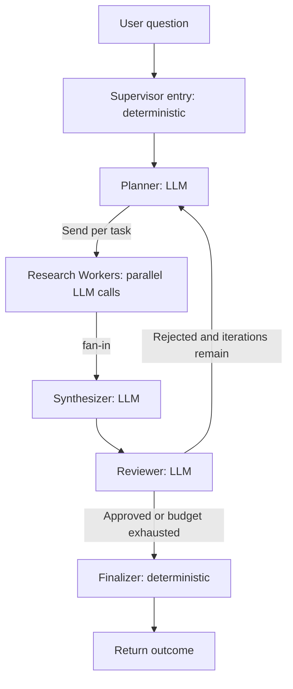
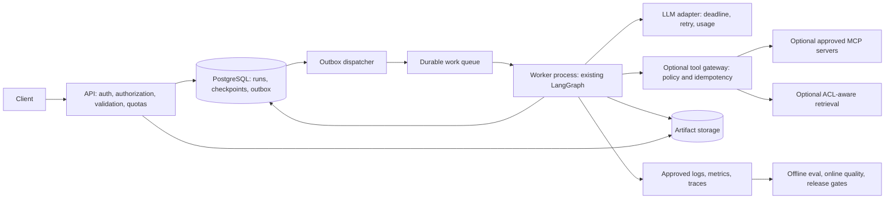

# Production Agent Architecture Assessment

评估日期：2026-09-12  
范围：当前 `06-production-agent` 目录；主线为 `src\multi_agent_research`，同时检查保留的 Specialist、Handoff、Supervisor、Parallel、Shared State 实验。  
变更边界：只新增本文档，不修改源代码、依赖或配置。

## 结论与评估边界

**当前是具有生产化扩展基础的 Multi-Agent Research 原型，不是可直接对外提供多租户服务的 Production Agent。** 已有明确 Graph、节点职责、动态 fan-out/fan-in、结构化 Worker 结果、审阅循环上限和局部失败隔离。主要缺口是持久化恢复、真正可控的执行时限、严格数据契约、租户权限边界、可观测性以及独立质量评估。

三个容易混淆的概念：

- `InMemorySaver` 是进程内 checkpoint，不是进程崩溃后可恢复的数据库，也不是长期 Memory。
- Research Worker 当前只有模型调用，没有搜索、文档检索或 RAG；模型声称“根据官方文档”不等于已经获取并验证证据。
- Reviewer 是业务执行链的一环，不是独立 Evaluation，也不是可信安全审批器；完成 Graph 不等于答案通过质量验收。

本文区分 **已存在的实现事实**、**可从代码推导的失败模式**、**尚未实现的目标设计**。没有执行真实模型请求、部署或攻击验证；未读取 `.env` 的值。当前目录没有 `.venv`、测试文件、评估集、CI 或部署清单，`traces` 目录为空。源码中提及的旧 `docs` 和 `tests` 不能当作当前目录已有的交付物。当前目录不是 Git 仓库，无法据此确认历史提交、密钥历史或版本基线。

安全专项没有返回可定位的已确认漏洞，不能据此声称系统安全。下文安全内容是架构风险及上线控制要求，不把未接入的 MCP、数据库、HTTP API 或执行工具描述成现有攻击面。

## 1. 当前项目检查：14 个维度

以下证据路径均相对项目根目录，行号对应本次读取的源码。

| 维度 | 当前实现与证据 | Production 差距 |
|---|---|---|
| 1. Agent architecture | 主线有 Planner、Research Worker、Synthesizer、Reviewer 四类 LLM 角色；Supervisor entry/Finalizer 是确定性函数，不调用 LLM。`src\multi_agent_research\graph.py:67-135` | 缺 Agent 版本、运行身份、独立预算与标准执行结果封装 |
| 2. Graph architecture | `START -> supervisor_entry -> planner -> research_worker* -> synthesizer -> reviewer`；不通过且仍有预算则返回 Planner，否则 Finalizer。`graph.py:107-135` | 缺显式失败、取消、重试等待、人工审批及恢复状态 |
| 3. State management | `TypedDict`；节点返回局部更新；`worker_results` 和 `trace` 用 `operator.add` 累积。`state.py:101-161` | 静态类型不是运行时校验；缺 schema version、去重 reducer、租户所有权与并发写入控制 |
| 4. Tool layer | 主线 `TextLLMCall` 只是 `(system_prompt, user_prompt) -> str` 的客户端适配器；不是模型可选择的 Tool。旧 Supervisor 使用三个 `Agent.as_tool()`。`src\specialists\llm.py:17-43`；`src\03_supervisor.py:172-206` | 没有通用外部工具层、统一参数契约、权限、超时、幂等与审计策略 |
| 5. MCP integration | 主线及实验均未接入 MCP server/client；没有 server 配置、传输或工具发现代码 | 属于未实现能力；如接入，必须先设计 server 信任、认证、工具白名单与输出边界 |
| 6. Memory | 每次运行有工作 State；主线 CLI 创建 `InMemorySaver`，公共函数默认 `checkpointer=None`。`main.py:41-46`；`graph.py:160-189` | 无跨进程持久化、长期用户记忆、生命周期、遗忘/删除机制 |
| 7. RAG | Worker 直接生成文字；没有 ingestion、embedding、index、retriever、reranker 或可核验 citation。`research_worker.py:88-98`；`synthesizer.py:28-44` | 无外部事实 grounding；需要实时研究时才应引入检索，不能把 RAG 当成所有生产 Agent 的强制依赖 |
| 8. Multi-Agent orchestration | 主线是固定控制流 + LLM 动态拆题 + 同类 Worker 并行 + Reviewer 反馈；`Send` 只给 Worker 单个任务。`planner.py:79-147` | 非分布式执行；任务缺稳定业务 ID、全局并发配额、调度公平性 |
| 9. Evaluation | Reviewer 输出完整性、事实一致性、证据质量、逻辑一致性和遗漏方面。可注入 `TextLLMCall`，方便离线测试。`reviewer.py:23-106` | 当前无独立标注集、测试文件、评分脚本、回归基线或 CI quality gate |
| 10. Error handling | Worker 将异常转成 `failed/timeout`；Planner/Synthesizer/Reviewer 异常可直接中止 Graph；耗尽审阅预算交付注明未通过的 best-effort。`research_worker.py:95-126`；`graph.py:86-102` | 缺错误分类、重试预算、整体 deadline、运行终态及统一失败响应 |
| 11. Logging | 主线为 State 中字符串 trace 和 CLI 打印；旧 SDK 实验通过本地 exporter 写 JSONL。`main.py:86-99`；`src\tracing.py:33-63` | 主线没有 LLM/span 埋点、耗时/token 指标、集中日志与告警；旧 exporter 不自动覆盖普通 OpenAI 客户端 |
| 12. Configuration | `.env` / 环境变量提供模型参数；默认 6 Workers、3 轮、Worker 30 秒；依赖部分使用范围版本。`main.py:29-46`；`state.py:39-41`；`requirements.txt:1-5` | 缺统一配置 schema、上限验证、环境分离、版本锁定及可追溯配置摘要 |
| 13. Security | 当前是本地 CLI，无业务鉴权服务；代码中的 Worker 输入缩减和字段归属是逻辑隔离，不是权限隔离；`.gitignore` 忽略 `.env/.venv/traces` | 对外服务前需身份认证、逐资源授权、数据脱敏、出口策略及 secret 生命周期管理 |
| 14. Deployment | 只有 Python CLI 入口和 `requirements.txt`，要求 Python 3.10.8；没有容器、服务入口、队列、数据库或部署流水线 | 缺可重复构建、健康探针、资源限制、发布回滚、长任务托管与灾难恢复 |

### 1.1 主线 Graph



每个 Worker 返回 `completed / failed / timeout`，所以单个 Worker 失败通常不会阻断 fan-in；但其他节点的异常、调度或 checkpoint 写入异常并没有相同的保护。所有 Worker 都失败时，当前仍可进入 Synthesizer/Reviewer，没有确定性的“无有效证据，停止交付”分支。

默认每轮最多 6 次 Worker 调用加 Planner、Synthesizer、Reviewer 各一次，3 轮最多 **27 次应用层 LLM 调用**。这个数字不包括 SDK 的内部 HTTP 重试，不能视为计费请求上限。`max_workers` 和 `max_iterations` 是可传入参数，初始化只验证不小于 1，默认值不是不可突破的系统硬上限。

### 1.2 不要混为一个已集成系统的历史实验

| 入口 | 控制权与状态 | 与主线的关系 |
|---|---|---|
| `src\specialists\research_agent.py` / `coding_agent.py` / `review_agent.py` | 每个是一个独立单节点 LangGraph，明确输入输出 | 主线复用的是 `specialists\llm.py`，不是把这三个 Graph 嵌套起来 |
| `src\02_handoff.py` | SDK Triage 把对话控制权移交给 Research/Coding；目标 Agent 最终回答；默认 `max_turns=10` | 独立 Handoff 实验，不在主线 Graph 中 |
| `src\03_supervisor.py` | SDK Supervisor 把 Specialist 作为 Tool 调用，保留最终回答权；默认外层 `max_turns=10` | 主线 Supervisor 不是这个 LLM Supervisor；外层 turn 上限也不是整个嵌套调用树的统一成本预算 |
| `src\04_parallel_multi_agent.py` | Planner -> 并行 Worker -> Synthesizer；有默认 90 秒整体等待超时 | 该整体超时未移植到主线，且其 daemon thread 方案也不是底层取消 |
| `src\05_shared_state.py` | Research -> Analysis -> Review 循环 -> Finalizer；可注入 checkpoint | 是字段 ownership 和反馈循环的先行实验，不是长期 Memory |

## 2. 目标架构：保留 Graph，补齐运行平台

下图全部是建议，当前尚未部署。默认采用云中立方案，不要求更换现有编排框架，也不预设 Microsoft Foundry 或其他托管平台。



优先保留确定性 Supervisor、四类角色、局部 State 更新及 `Send` 并行；先把执行生命周期做可靠，再按需求接检索或工具。小规模起步可以一台主机运行 API 和有限数量 Worker，但 durable state 必须在进程外。不要先引入跨地域调度、复杂微服务或长期记忆。

建议把可恢复业务 State 和运行平台元数据区分开。业务 State 保留问题、计划、结果、综述和评审；运行记录补充 `tenant_id`、`user_id`、`run_id`、`thread_id`、`status`、`deadline_at`、`schema_version`、`graph_version`、`prompt_version`、`model_version`、`config_hash`、`attempt`、`lease_owner`、`fencing_token` 和预算消耗。身份与权限由服务端注入，不由模型生成或覆盖。

建议生命周期：

```text
queued -> running -> succeeded | degraded | failed | cancelled | timed_out
                  -> retry_wait -> running
                  -> awaiting_approval -> running | cancelled
```

`degraded` 表示有可展示产物但未通过质量门槛或证据不足；不能把 `review.approved=False` 包装成普通成功。人工审批只在业务确有高风险动作时启用，不要求每次文本研究都审批。

## 3. Reliability

### 1. 哪些地方可能失败？

| 环节 | 当前失败模式 | 影响和处理方向 |
|---|---|---|
| 启动与配置 | key/model 缺失会退出；端点、TLS、依赖或 SDK API 不兼容可能启动/调用失败 | 当前只校验配置存在；生产启动要验证完整配置、依赖组合和必需存储 |
| LLM 请求 | 连接错误、429、5xx、超时、余额不足、无权限、上下文超限 | 建立错误分类，不能用一个 `failed` 字符串支撑运维 |
| LLM 返回值 | `choices` 为空可能索引失败；`content=None` 转为空字符串；未检查 `finish_reason`、拒绝或截断。`src\specialists\llm.py:35-43` | 空结果可能被 Worker 标成 completed，截断可能污染 Planner/Reviewer；需响应契约和显式失败原因 |
| Planner | 宽松解析把任意 JSON 元素 `str()` 化，或把非 JSON 文本逐行当方面；空列表才报错。`planner.py:53-76` | 错误/重复计划可消耗预算；需要严格 schema、长度限制和任务去重 |
| Reviewer | `bool(parsed["approved"])` 会把字符串 `"false"` 判成 True；缺其他字段仍可通过。`reviewer.py:61-76` | 这是具体质量门禁缺陷；不能把“非法 JSON 拒绝”理解为“所有无效 verdict 都拒绝” |
| Worker | 30 秒线程等待超时后网络请求仍可继续；普通异常丢失类型和堆栈，只留下 `str(exc)` | 超时不是取消；长驻服务会累积未结束调用、连接和成本 |
| fan-in / synthesis | 全部 Worker 失败仍汇总；历史结果持续拼入 prompt；失败项没有确定性地被补偿重试 | 可能无证据交付、上下文超限或因旧结果噪声降低质量 |
| 反馈循环 | Reviewer 未通过但 `missing_aspects=[]` 时，Planner 重新初始拆题，未利用其他反馈。`planner.py:83-95` | 可能反复做相同研究，消耗完轮数；需要反馈分类和“无进展”检测 |
| 运行终止 | 主线没有总 wall-clock deadline；Planner/Synthesizer/Reviewer 无应用层节点超时 | 有限轮数和 recursion limit 不能限制单次请求耗时 |
| State / 恢复 | 进程退出丢失 InMemorySaver；重放的追加更新没有幂等去重 | 无法保证恢复，不应把重新初始化同一 thread 当 resume |
| 日志及未来存储 | 文件写入、磁盘满、存储连接、队列投递或 exporter flush 都可能失败 | 区分遥测故障与业务故障；关键审计/提交失败不得静默声称成功 |

### 2. 哪些失败可以 retry？

可在**剩余时间、调用次数、token/成本预算允许**时重试临时连接失败、受限类型的超时、429 rate limit、可恢复的 5xx，以及未来读取工具的临时失败。429 若表示余额/配额耗尽而非短期速率限制，不能按相同策略重试。

建议由一个统一 LLM/Tool 适配层负责分类，应用层最多额外重试 2 次作为初始策略，指数退避加随机抖动并尊重 `Retry-After`；总 deadline 优先于退避。明确 SDK 自带重试与外层重试的关系，避免相乘。当前 `OpenAI(...)` 没有显式设置 timeout/max_retries，实际内部行为取决于解析安装的 SDK 版本，不能说当前完全没有重试或底层无限等待。

错误输出可做**一次有预算的格式修复请求**，但属于新模型推理，不是网络重试。Reviewer 打回后的补充研究也是业务迭代，必须分别统计 `transport_retry_count`、`schema_repair_count`、`review_iteration`，不能混成“重试次数”。

### 3. 哪些失败不能 retry？

| 类型 | 正确动作 |
|---|---|
| 401/403、错误 API key、无模型权限、拒绝的工具权限 | 立即终止或请求重新授权；禁止自动扩大权限或改用更高权限凭证 |
| 无效输入、超长输入、非法配置、错误模型名、schema 不兼容 | 返回具体错误；先修复输入/配置，不原样循环重发 |
| 内容拒绝、策略拒绝、人工拒绝 | 保持拒绝或进入允许的业务路径，不能用重试绕过 |
| 已取消、总 deadline/token/成本预算耗尽 | 记录终态，取消或隔离仍在执行的调用 |
| 确定性代码异常、状态损坏、存储 schema 版本不兼容 | 告警并隔离 run，修复或迁移后恢复 |
| 写操作已经发送但结果未知，且外部系统不支持幂等或查询 | 先 reconciliation 或人工处理；禁止盲目重放 |
| 多轮质量无改进 | 降级、明确失败或人工复核，不再重做完整链路 |

### 4. 哪些操作必须 idempotent？

**幂等不等于“同样 prompt 永远生成同样文本”。** LLM 重复调用可能增加成本、产生不同内容。需要保证同一业务动作不会被重复提交，已完成且记录成功的产物不会被重复执行。

| 操作 | 建议幂等键或机制 |
|---|---|
| 接收研究任务 | `(tenant_id, client_idempotency_key)` 唯一；另保存请求摘要；相同 key 不同内容报冲突 |
| 计划落库与 Worker 调度 | `(run_id, plan_version, task_id)`；任务 ID 在计划提交时固定，不在重试时重新生成 |
| Worker 结果提交及 State 聚合 | `(run_id, task_id, result_version)` 唯一；attempt 单独记录；每个逻辑任务只接受规定版本的有效结果 |
| checkpoint 和 run 状态更新 | 事务/CAS + checkpoint 版本 + fencing token，拒绝过期 Worker 的写入 |
| 最终报告发布、通知、计费记账 | `(run_id, output_version, operation)`；结果与 outbox 在同一事务中提交 |
| 将来的 Memory/RAG ingestion | 租户、源文档 ID、内容版本/chunk ID；幂等 upsert，删除也应幂等 |
| 将来的外部写 Tool/MCP | 业务 operation ID 透传给下游；先查回执再补偿，不凭超时推断“未执行” |

当前 Planner 的随机 UUID 在重跑时会变，`operator.add` 也不会去重。它们适合当前单次受控聚合，不提供业务重放保证。不能由此断言 LangGraph 每次正常恢复都会重复已完成节点；重复风险取决于恢复点、持久化 pending writes 和外部提交边界。

### 5. 哪些任务需要 checkpoint？

默认 Research 最多涉及多轮、多次付费模型调用，应该以**节点/图 superstep 的已提交边界**持久化；不得假设任意执行到一半的 Python 线程可以续跑。

| 边界 | 应持久化内容 |
|---|---|
| 接受任务、执行前 | 身份归属、原始输入引用、运行版本、预算、deadline、run/thread ID |
| Planner 完成、fan-out 前 | 确定的计划版本、稳定任务 ID 和调度意图 |
| 每个 Worker 完成 | 结果或失败原因、attempt、usage、证据引用；利用所选 saver 支持的 pending writes，必要时另设任务结果表 |
| fan-in、synthesis 完成 | 已消费结果版本、汇总产物引用、上下文预算 |
| Reviewer 完成和下一轮开始前 | 严格校验的 verdict、剩余缺口、iteration、预算，避免恢复后额外循环 |
| 人工审批/长时间等待 | 审批材料版本、权限范围、审批状态和有效期 |
| 最终交付 | 最终状态、产物版本、outbox 事件，保证“提交成功但响应丢失”可查询 |

接入与当前 LangGraph 兼容的 durable checkpointer，例如 PostgreSQL；这是待实施依赖，不是当前已安装能力。checkpoint 之外的大文档进入受控对象存储，只在 State 保存有版本的引用。

### 6. 哪些任务需要 timeout？

所有跨进程/网络操作，以及可能长时间等待的编排步骤都需要期限。

| 层级 | 策略 |
|---|---|
| API 接收/状态查询 | 短请求时限；不让 HTTP 请求持有整个研究生命周期 |
| LLM 传输 | connect/read/write/pool timeout，覆盖四类 Agent，而不只 Worker |
| Agent 节点 | 用剩余 run deadline 裁剪节点预算；解析/修复请求也计入 |
| 外部 Tool/MCP/RAG | 每个工具独立超时；工具描述不能覆盖服务端上限 |
| DB/checkpoint/队列 | 连接、事务、锁、投递确认超时 |
| 整个 run | 持久化 `deadline_at`，重试和恢复不能重新获得完整预算 |
| 审批/排队/租约 | 排队 TTL、审批过期、heartbeat 和 lease expiration 分别设置 |
| 停机 | 有限 graceful shutdown；停止领取任务，提交已完成工作，超时退出 |

可先使用 Worker 30 秒、其他 LLM 节点 45 秒、run 300 秒作为**待压测的初始预算示例**，不是已经存在的配置或 SLA；单节点预算之和可能超过总预算，总 deadline 必须优先截断。并行阶段延迟取最慢分支而非各 Worker 时间简单相加。

不要继续用“daemon thread 超时后不等待”作为长期运行服务的完整取消方案。优先使用支持超时与取消的异步客户端；无法取消的第三方调用放入受控子进程或隔离执行器。即使本地连接关闭，也不能保证服务端停止生成或不计费，要跟踪结果未知和迟到响应。

## 4. Security

### 安全专项结论

未收到含文件/行号及可利用路径的已确认漏洞报告；本表不等于通过安全验收，以下问题仍需上线前控制与针对性验证。

| # | Severity | File | Lines | Vulnerability | Confidence |
|---|----------|------|-------|---------------|------------|
| — | — | — | — | 无可定位的已确认漏洞；不代表风险不存在 | — |

### 7. Prompt Injection 风险在哪里？

| 数据入口/传播路径 | 当前情况与风险 | 建议边界 |
|---|---|---|
| 用户问题 -> Planner | 用户文本影响研究计划 | 固定系统职责；输入长度和结构限制；生成计划后再做 schema/预算检查 |
| 问题、aspect、reason -> Worker system prompt | `research_worker.py:88-93` 把用户及模型生成内容插入 instructions；`llm.py:39` 将其作为 system message 发送 | 固定系统提示；把不可信问题/任务放到数据消息或明确字段中，避免提升其指令优先级 |
| Worker findings -> Synthesizer -> Reviewer | 生成文本也不可信，可能夹带后续指令；Reviewer 只看到问题和综述，不是独立原始证据集 | 标识来源、隔离引用内容；任何权限/交付门禁由代码执行，不能由正文中的“已批准”决定 |
| Reviewer feedback -> 下一轮 Planner | 输出可能继续影响计划；非法格式的原文会成为 feedback | 严格校验字段、长度和允许的控制动作，反馈不授予新能力 |
| 将来的网页、RAG 文档、MCP 工具返回 | 当前不存在这些入口；接入后会增加间接注入和工具描述污染风险 | 把检索/工具内容当数据，固定工具注册表，保留 provenance，限制输出规模并做对抗评估 |

分隔符、提示词和“不要听恶意指令”只能降低风险，不构成安全边界。当前主要后果是答案/评审污染、错误路由与成本浪费；不能据现有代码推断已经能通过 prompt 读取文件或执行 shell。

### 8. Tool Abuse 风险在哪里？

主线没有模型可调用的业务 Tool。旧 `03_supervisor.py` 的三个 Tool 实际是文本 Specialist；`coding_expert` 输出代码方案，并不执行代码。现有风险主要是无必要或重复专家调用、超长参数、错误工具选择和成本放大，不是已存在数据库写入或命令执行。

引入真实工具之前，建立固定注册表，记录 `name/version`、输入输出 schema、`read/write` 分类、允许角色、required scopes、超时、幂等策略和调用配额。必须在工具执行层重新授权；最小化网络出口，对 URL 类工具控制域名、地址范围及重定向，限制文件路径与响应大小。写操作审批绑定具体参数摘要、操作者、有效期和 operation ID，不能审批一次后允许任意新参数。

MCP 特别要求：只连接批准的 server，固定/审核工具描述及版本；按 server/tool 配置最小权限凭证，设置会话、调用与发现超时；远端认证遵循所选传输规范；stdio server 用独立低权限进程和受控环境变量。MCP 是协议，不自动提供租户授权、幂等或安全沙箱。

### 9. Agent 是否可能执行越权操作？

**当前未发现可让模型直接操作 OS/数据库的已注册能力，因此不能认定已有任意执行或业务越权漏洞。** 但所有 Agent 在同一宿主进程和同一模型凭证下工作，角色提示与 State 字段归属并不是 OS 或业务权限隔离；运行程序拥有的凭证和能力，仍需要平台约束。

对外 API、数据库或写 Tool 接入后，授权必须检查“用户/租户 + 动作 + 目标资源”，默认拒绝。Agent 不能自行决定 `tenant_id`、审批结果或 credential scope。工具凭证不放进 prompt，跨 Agent 传递上下文遵循最小必要原则。Handoff 的完整对话传递尤其不能被当作匿名、无敏感内容的工具参数。

### 10. Secret 应该如何管理？

当前从环境读取 `OPENAI_API_KEY`、`OPENAI_MODEL`、`OPENAI_BASE_URL`，本地 `.env` 已被 `.gitignore` 忽略；这不证明历史从未泄漏，也不检查文件 ACL、同步副本或备份。

开发可保留本地 `.env`，但不得进入镜像、提交、prompt、日志或测试 fixture。生产使用组织批准的 secret manager，通过 workload identity 或启动时受控注入获取短期/可轮换凭证；按环境和服务拆分，授予最低配额，记录访问审计并制定吊销流程。错误消息和 exporter 输出统一脱敏。

生产必须明确批准模型端点和数据驻留，不依赖缺失配置时的公共端点默认值；固定 HTTPS 和允许的 host，不让终端用户指定任意 `base_url`。本地 tracing 只改变旧 SDK 的 trace 目的地，不改变模型请求本身的数据流向。项目位于同步目录，敏感配置、checkpoint 和 trace 的存放地点需按组织数据政策批准；不能仅凭目录名称断言已经发生外传。

### 11. 用户之间的 State 是否可能泄漏？

当前无多用户服务；每次通常新建 State 和随机 `thread_id`，Worker 的 `Send` 也只带一个任务，没有证据说明普通两次 CLI 运行必然串数据。

**但这不是多租户隔离保证。** 公共函数允许外部提供 `thread_id` 和共享 checkpointer（`graph.py:160-189`）；状态没有 tenant/user 字段或所有权校验。如果将来把这些参数直接暴露给客户端，相同 thread 的历史读取/继续执行及 reducer 累积将形成跨用户污染风险。随机 ID 防碰撞，不代替授权。

生产由服务端生成并绑定 run/thread；每次查询、恢复、取消和 artifact 下载都检查租户所有权。数据库启用相应行级或等效隔离；checkpoint、Memory、缓存、RAG 检索、对象存储及 trace 查询均采用一致 ACL。检索权限必须在检索阶段过滤，不能先取其他租户内容再让模型“不输出”。跨租户负例测试需覆盖读取、续跑、删除和相同业务 key。

## 5. Observability

### 12. 如何知道 Agent 为什么失败？

当前主线的 `trace: list[str]` 能说明走过哪些节点，但不能可靠回答耗时、尝试次数和根因；异常中止时 `main()` 不会拿到正常 outcome 并打印最终 trace。Worker 只存异常文字，缺少异常类型/堆栈。旧 SDK 的本地 trace 功能不会自动为主线产生 span。

在运行开始就建立 root span，子 span 覆盖节点、模型请求、Tool、重试和 checkpoint；成功、异常、取消均写结束事件。用 `run_id/thread_id/trace_id/span_id/parent_span_id/task_id/attempt` 关联，记录阶段、错误分类、可否 retry、剩余预算、耗时、provider request ID 和版本信息。为运维保留受限的已脱敏 stack trace，不向终端用户返回原始异常。

建议错误结构包含 `code/category/retryable/node/task_id/attempt/provider_request_id`；用户看到稳定的错误码和 run ID，运维可定位“哪个节点、哪个依赖、哪次 attempt、为什么停止”。记录路由输入摘要、决策理由和规则版本即可，不要求保存模型私有思维链。

### 13. 如何知道哪个 Tool 最慢？

当前主线没有 Tool，因此当前应先比较 LLM 角色/节点延迟。旧 Supervisor 的 `extract_expert_tool_calls()` 只给调用顺序，不给耗时。

为每个 tool call 建 span，记录工具/版本、开始结束、状态、参数大小和 attempt；按 tool/version 汇总 p50/p95/p99 latency、timeout rate、retry rate。把排队耗时、工具执行耗时、重试退避、外部网络耗时分开；一个 agent-as-tool 的父 span 包含内部模型调用，不能把父子延迟简单累加。并行 run 通过 critical path 定位拖慢 fan-in 的最慢 Worker。

### 14. 如何知道哪个 Agent 消耗 token 最多？

当前 LLM 适配器只返回正文，丢弃 `response.usage`，无法从最终文字准确反推计费 token。应在适配器记录每次调用的 input/output/total tokens、缓存 token（若提供）、模型版本及价格表版本，并带上 Agent 角色、run/task/attempt 标签。

按 Planner、各 Worker、Synthesizer、Reviewer 聚合 token/成本，并保留 nested Agent 的 parent/child 关系，分别展示 self usage 和 inclusive usage，避免双重计数。网络重试、格式修复、审阅循环、超时但已计费请求也应纳入或明确标为 unknown。网关不返回 usage 时可以单独标记估算，不能填 0 假装免费。

### 15. 如何知道某个版本上线后质量下降？

将每个 run 绑定 `release_id + graph_version + prompt_version + model/deployment_version + config_hash`；后续接 RAG/Tool 时追加 corpus/index/tool schema 版本。没有这些标签，就无法区分代码、模型、数据或用户分布变化。

发布前用固定评估集比较候选版与基线；发布后按版本、任务类型和租户规模看质量通过率、证据正确性、错误拒绝率、degraded 比例、Worker 失败率、延迟及成本。使用小流量 canary；按样本量和置信区间分析，不把一天两条负反馈直接归因于版本。模型供应商静默更新也要通过周期性基准捕获。

**建议初始告警/门禁示例，非当前 SLA：** 任一关键授权或数据隔离用例失败即停止发布；同一有代表性样本上的任务成功率下降超过 5 个百分点，或 p95 延迟/平均成本超过基线 20%，触发复核并暂停扩流。质量和可靠性分别统计：技术成功不代表研究正确，Reviewer approval rate 也不是事实正确率。

日志默认只存元数据和摘要，敏感正文经批准后有限采样，设置 retention、RBAC 和删除策略。run ID 等高基数字段进日志/trace，不作为所有 metrics 的标签。关键错误和安全事件保留，正常完整正文不无限留存；关闭流程明确 flush，监控 exporter 丢弃和失败数。

## 6. Evaluation

### 16. 如何持续验证 Agent quality？

建立版本化、人工校准的 golden dataset，覆盖常规研究、复杂拆题、需要最新事实、缺证据、冲突证据、拒绝、注入、长输入、部分/全部 Worker 失败。每条案例保存任务标签、必须覆盖的方面、参考事实/来源、允许的不确定性、预期终态及预算；不要只保存一段必须逐字匹配的参考答案。

| 层级 | 方法 | 频率和产物 |
|---|---|---|
| 确定性契约 | 假 LLM、固定返回值、状态/路由断言、错误注入 | 每次提交；快速、离线、无模型成本 |
| Graph 集成 | 真实编排 + 假模型；未来加本地可控的存储/工具 fixture | 每次相关变更；验证 fan-out/fan-in、恢复和去重 |
| 模型质量 | 固定数据集，候选版与基线成对运行；多次采样估计方差 | prompt/model/graph 变更和定期运行；保存分项分数与成本 |
| 独立评审 | 确定性引用/事实检查 + 人工抽样 + 经校准的独立 judge | 发布前与线上抽样；不要只用运行时同一个 Reviewer 自评 |
| 线上闭环 | 经授权脱敏的失败样本、用户反馈、人工复核 | 持续采样；回流评估集并标注，不直接把隐私原文加入数据集 |

质量至少分开衡量任务完成、事实/证据、覆盖率、逻辑、一致的拒绝行为、成本和延迟。judge 自身也需要版本、盲评、与人工一致性校准及防注入测试。当前没有检索时，“最新事实/精确引用”类应承认证据限制或拒绝断言，而非默认算成功。

### 17. 如何进行 regression test？

复用现有可注入的 `TextLLMCall` seam，未来使用已声明的 pytest；本次不新增测试或依赖。当前文件注释提及的测试不在此目录，不能假设已经覆盖。

| 必测案例 | 预期断言 |
|---|---|
| 正常一轮 / 驳回后通过 / 始终驳回 | 路由正确，轮数不超限；最后一种是 degraded 而不是 approved |
| `{"approved": "false"}`、缺字段、非法 JSON、空返回、截断 | 严格拒绝无效 verdict；不能因字符串真值而放行 |
| Planner 空输出、非字符串项、重复项、超过上限 | 清楚区分失败与修复；仅派发合法去重任务，不突破服务配额 |
| 部分 Worker 超时/失败 / 全部失败 | fan-in 完整；失败可观测；无证据时不能正常成功 |
| 各节点 ownership、Worker 输入隔离 | 只写允许字段；Worker 不收到其他任务/其他租户内容 |
| 未通过但无 missing_aspects | 处理具体 feedback 或退出，不无意义地重新初始拆题 |
| 429/503/401/403、重试 budget、取消 | 临时故障有限重试，永久拒绝不重试，总预算可终止 |
| 重复消息、同一 task 重放、迟到结果 | 结果与发布幂等；过期 lease 拒写 |
| 进程在 fan-out/结果落库/发布前后崩溃 | durable checkpoint 恢复；不丢提交结果、不重复产生外部副作用 |
| 同 ID 跨用户访问/恢复/取消 | 全部拒绝；包括未来 RAG、Memory、缓存和 artifact |

固定模型响应测试使用精确断言；真实模型输出评估使用结构/语义指标和容差，而不是整段 snapshot。随机 task ID 和并行结果排序需正规化或按任务集合比较，不能让非业务差异造成 flaky tests。升级 Python/SDK/checkpointer 时独立验证导入、checkpoint 兼容和恢复流程。

### 18. 如何评估 tool selection？

主线当前没有 tool selection，应报告 **N/A**，不是 100% 正确或 0% 正确。已有可评估对象是旧 Supervisor 的 `research_expert/coding_expert/review_expert` 调用，`src\03_supervisor.py:270-301` 可提取工具序列及结果；后续真实 Tool/MCP 复用同样评估契约。

为每个案例标注“允许/必需/禁止工具集合、可接受调用顺序、参数约束、正确的不调用场景”。统计 tool precision/recall、参数合法率、无必要调用率、必需工具遗漏率、重复调用率、拒绝正确率、预算和最终任务成功率。允许多个等价正确序列，不把合理替代路径误判错误。

例如“调研并审阅”应把研究结果作为 review 输入，不只是某处各调用过一次；“仅需简短回答”应允许零工具；越权写入请求必须在实际执行前被拒绝。先用 stub Tool 测正确选择与契约，再在受控环境测真实执行；模型选择正确和工具执行成功是两个指标。

### 19. 如何评估 multi-agent routing？

| 路由层 | 当前对象 | 指标与断言 |
|---|---|---|
| Handoff | Triage -> Research/Coding；`src\02_handoff.py:230-256` 可提取转接事件 | 分类混淆矩阵、宏平均 F1、混合意图处理、正确最终答复 Agent、无意外转接 |
| Agents-as-Tools | Supervisor -> 三类专家 -> Supervisor 回答 | 必需调用召回、调用顺序/参数关联、最终控制权、无效嵌套成本 |
| 动态拆题 | 主线 Planner -> 同类 Research Worker | 必要方面覆盖率、任务重叠率、无关任务率、fan-out 数量、预算合规 |
| fan-in | 同轮全部 Worker -> Synthesizer | 结果完整、重复为零、失败显式、不得提前忽略未结束任务 |
| review feedback | Reviewer -> Planner/Finalizer | 路由真值表、增量补缺成功率、无进展循环率、耗尽预算后正确 degraded |

主线并没有 LLM 选择 Research/Coding/Review 的分类路由，不应套用 Handoff 分类准确率评价整个主线。分别测“确定性边是否正确”和“LLM 拆题/评审是否有用”，最后用端到端质量衡量编排价值，并与单 Agent 基线比较质量收益是否值得额外成本。

## 7. Operations

### 20. 如何部署？

**当前只有本地运行方式，没有生产部署物。** 以下命令是现有 CLI 的开发入口说明，不是此次已经执行或已上线的结果：

```powershell
# Python 3.10.8；只在项目 .venv 不存在时创建
if (-not (Test-Path .\.venv)) {
    & C:\Python310\python.exe -m venv .venv
}
.\.venv\Scripts\python.exe -m pip install -r requirements.txt
.\.venv\Scripts\python.exe -m src.multi_agent_research.main "需要研究的问题"
```

运行前通过本地环境提供 `OPENAI_API_KEY` 和 `OPENAI_MODEL`；显式批准 `OPENAI_BASE_URL`。不要在 shell 示例中粘贴真实 secret。

生产建议按以下交付顺序实施：

1. 统一入口和配置校验，形成锁定直接/间接依赖的可重复构建；验证 Python 3.10.8 与 Agents SDK、LangGraph、saver 的组合。当前 `openai` 是直接 import 却未在 requirements 单独声明，依赖传递安装；应显式管理该直接依赖。运行时升级另立变更，不能直接破坏当前 Python 要求。
2. 增加 API 与异步 Worker 两类进程，接入 durable checkpoint/run store/queue；首次可单实例，但不能将 InMemorySaver 当生产存储。用事务 outbox 解决“run 已创建但队列未投递”问题。
3. 构建非 root/低权限镜像，排除 `.env`、本地 traces 和缓存；设置 CPU/内存/并发/出口限制；secret 由运行平台注入，不进镜像层。
4. 配置启动检查、liveness/readiness、metrics endpoint、结构化日志和优雅停机。readiness 检查必要存储/队列可用性，不以频繁付费模型调用充当探针；供应商健康单独监控。
5. CI 通过契约/回归/质量门禁后进入 staging，再小流量 canary；保留上一版镜像、配置、prompt 与 schema 兼容策略，具备明确回滚条件。数据库迁移与旧 run 恢复应向后兼容，不能仅回滚镜像。

容器清单、Dockerfile、CI、数据库迁移、HTTP 路由均属后续工作，本文不把示意组件当成现有命令。当前无 Git release，首次上线前必须建立可追溯的源码/构建版本。

### 21. 如何扩容？

当前 `Send` 是进程内并发，不是跨机器调度。先按独立 run 横向增加 Worker 进程/副本，保持一条 run 同时只有一个有效 lease owner；单个 Graph 内的 fan-out 继续由 LangGraph 执行。需要跨机器分发同一 run 的子任务时再增加任务级队列与 fan-in 协调，不要以为给 `max_workers` 加大就实现分布式。

扩容依据 queue age、队列深度、活跃 run、内存、模型 RPM/TPM 和 p95 延迟；增加每租户公平调度以及全局 semaphore/token bucket。若同时有 C 个处于研究阶段的 run，每轮最多 W 个 Worker，则该阶段活跃模型调用约为 `C * W`，还需预留其他节点、重试以及未取消的迟到请求。不能仅根据 CPU 空闲无限扩容。

先压测单 run 的最大 token、上下文和内存，再确定每进程并发与副本上限。模型限流时降低并发/排队，配合熔断和恢复探测；扩容不得把供应商 429 放大为重试风暴。

### 22. 如何处理长时间运行任务？

API 接受后持久化 run 并返回 `202 + run_id`；客户端用授权后的状态查询或 SSE 订阅进度，断连不取消业务。Worker 从 durable queue 领取任务，heartbeat 续租，checkpoint 在阶段完成时落盘；队列消息只带 run 引用，不携带 secret 或整份敏感研究材料。

deadline、取消标志、预算、进度和重试计划都在运行存储里，不仅在进程内。退避或等待人工审批时持久化唤醒时间并释放执行资源，不用一个线程长期 sleep。用户取消后停止后续派发，并对不可取消的外部请求记录状态，拒绝迟到结果覆盖终态。

增加状态 TTL、产物/日志 retention、任务最大寿命、dead-letter queue 和人工处置入口；过期与失败明确区分。shutdown 时停止取新任务，提交完成边界，再让 lease 到期或安全释放，不能把所有在途任务直接标成功。

### 23. 如何恢复 crashed run？

**当前不能在进程崩溃后恢复：CLI 的 InMemorySaver 会丢失，公共 `run_multi_agent_research()` 也没有专门 resume 路径。** 即使传回同一个 `thread_id`，该函数仍构造 `initial_state()` 并 `graph.invoke(state, config)`，不等同于从 pending checkpoint 续跑。

目标恢复流程：

1. 发现 Worker heartbeat/lease 过期，重新领取任务并获取更高 fencing token，先检查取消、deadline、总预算与租户授权。
2. 按 run 固定的 Graph/prompt/model/schema 版本加载兼容 Graph，读 durable checkpoint、pending tasks/writes、任务结果表与外部操作账本。模型版本不可用时暂停或走显式迁移，不能偷偷换模型继续。
3. 有有效 checkpoint 时通过已锁定 LangGraph 版本支持的恢复 API 继续待完成步骤；普通未完成执行通常是同一配置下 `graph.invoke(None, config)`，人工 interrupt 则使用相应 resume 输入。实现时按所选 SDK/saver 验证，不能把 fresh-run helper 直接当恢复器。
4. 未提交的纯计算/LLM 步骤允许有预算地重做；已提交 Worker 结果不重复消费。checkpoint 之前已发出、但回执未记录的外部写调用，先查幂等回执/操作状态再决定重试。
5. 原子提交最终状态、产物引用和 outbox；dispatcher 可能重复发布，消费者以 operation/event ID 去重。恢复失败超过预算进入 dead-letter 或人工处理。

持久化 checkpoint 解决图状态恢复，不自动解决外部副作用的 exactly-once。应承诺可说明的 at-least-once 调度 + 幂等提交，并诚实记录无法取消或结果未知的请求。

上线验收需要覆盖“Planner 提交前后、部分 Worker 完成、checkpoint 写入前后、产物提交后通知前”等崩溃窗口，验证 RPO/RTO、重复调用与重复发布。建议先把“已确认提交的任务/结果不丢失”作为存储可靠性目标，并以故障演练确定恢复时限，不在没有演练时宣称零数据丢失或固定恢复秒数。

## 8. Production Readiness Gap List

优先级按**上线门槛和实施依赖**定义，不等同于安全漏洞 severity。P0 是对外、多租户、长时间任务生产服务的阻断项，并不要求本地教学 demo 全部具备。条件项在对应能力启用前升级为发布门禁。

### P0：生产上线前必须完成

| ID | Gap / 证据 | 改造方向 | 验收标准 |
|---|---|---|---|
| P0-01 | 严格质量门禁缺失；`reviewer.py:68` 字符串布尔误判；全 Worker 失败仍可继续 | Planner/Reviewer/LLM 输出运行时 schema 校验；空/拒绝/截断显式处理；终态区分 success/degraded/failed | `"false"`、缺字段、空响应、全 Worker 失败不得作为质量通过交付 |
| P0-02 | 主线无总 deadline；Worker 超时不取消；输入只有限的下界校验 | 传输/节点/run 分层时限，安全取消或隔离；服务端并发、输入、轮数、token/成本硬上限；timeout 必须是有限正数 | 任意节点挂起可在约定预算内终止/隔离；反复超时不无限增加线程、连接或费用 |
| P0-03 | InMemorySaver、fresh-run helper 无崩溃续跑能力；随机任务 ID + 追加 reducer 无业务幂等 | durable run/checkpoint、稳定任务 ID、去重结果、lease/fencing、专用 resume | 进程重启恢复已提交工作；重复投递不重复发布结果；旧 Worker 不能覆盖新状态 |
| P0-04 | 无用户/租户授权层；可外部传 thread ID；无数据访问生命周期 | 对外入口认证、逐资源授权、服务端 thread 归属、存储/查询隔离、日志脱敏和受控出口 | 跨租户读取/恢复/取消/artifact/缓存负例全部拒绝；secret 不进 prompt、镜像或日志 |
| P0-05 | 无当前测试集、评估基线和发布门禁 | 建立关键契约回归、初始 golden set、固定版本基线；失败阻断发布 | 质量/安全关键案例通过，候选版本可与基线比较；Reviewer 自评不得成为唯一门禁 |
| P0-06 | 主线缺失败根因、LLM usage、运行关联；无法运维定位 | 最小 run/node/LLM spans、错误码/stack、版本/usage、告警 | 任意失败能由 run ID 定位节点、依赖、attempt 和停止原因；usage 缺失明确标 unknown |
| P0-07 | 没有可重复部署和长任务执行生命周期 | 锁定依赖、配置验证、版本化构建、API/Worker/queue、outbox、健康检查、回滚与停机流程 | 从干净环境可重复交付；任务已接受不因进程退出丢失；部署与回滚能处理旧 run |

### P1：受控生产初期补齐

| ID | Gap | 改造方向 | 验收标准 |
|---|---|---|---|
| P1-01 | 缺统一瞬时错误 retry、熔断和 backpressure | 区分网络/业务迭代/格式修复；抖动退避、Retry-After、总预算与全局限流 | 429/5xx 故障注入可有限恢复；401/403 不重试；并发增加不形成重试风暴 |
| P1-02 | 审阅反馈缺口为空时重做初始拆题，失败任务依赖模型自行补齐 | 按失败任务/缺口精确补偿、任务去重、无进展检测 | 不重复无关研究；补缺覆盖率提高，循环次数和成本可解释 |
| P1-03 | State/上下文和日志增长缺治理 | 产物外置、结果版本选择、上下文截断/摘要策略、TTL/删除、受控日志保留 | 最大合法任务不超过上下文/存储预算，删除请求覆盖所有数据副本策略 |
| P1-04 | 无线上质量趋势与容量视图 | 分角色 token/成本、Tool/节点 p95/p99、错误率、canary 和质量漂移告警 | 能识别最慢依赖、最贵 Agent，以及具体版本的质量变化 |
| P1-05 | 无容量公平性与可操作恢复手册 | 队列伸缩、租户配额、DLQ、备份还原、崩溃/限流/停机演练 | 达到批准的容量和 RPO/RTO；故障有明确 owner 和处置路径 |
| P1-06 | 研究缺可核验外部证据 | 如产品承诺实时研究，接入最小只读检索、来源时间/版本及 citation 校验 | 事实结论可追溯，证据不足时正确降级；若首发承诺实时/高可信研究，此项升为 P0 |

### P2：按能力范围演进

| ID | Gap | 改造方向 | 验收标准 |
|---|---|---|---|
| P2-01 | 主线无标准 Tool/MCP 层 | 仅在真实需求出现时加入注册表、schema、server/tool 白名单、scope、预算与审计 | tool selection/参数/权限/超时用例覆盖；写 Tool 的授权和幂等在启用前升为 P0 |
| P2-02 | 无完整 RAG 数据链 | ingestion、版本化 chunk/index、ACL-aware retrieval、rerank、引用和 freshness | 检索召回、groundedness 和跨租户隔离达标；ACL 是启用前 P0 条件 |
| P2-03 | 无长期 Memory | 区分偏好记忆、事实记忆和 run checkpoint；显式写入策略、用户控制、TTL/遗忘 | 不把未经审查的模型输出永久当事实；读写/删除均按用户授权 |
| P2-04 | 模型/上下文成本优化无数据依据 | 按角色选模型、可信缓存、压缩上下文、与单 Agent 做受控对照 | 在固定评估质量不退化前提下降成本；缓存 key 包含租户和全部相关版本 |
| P2-05 | 缺自动化综合红队和 judge 校准 | prompt injection、工具输出污染、MCP 描述变更、judge 偏差的持续评估 | 对应能力启用前通过关键安全用例；新反例能加入固定回归集 |

### P3：规模或业务复杂度驱动

| ID | Gap | 改造方向 | 验收标准 |
|---|---|---|---|
| P3-01 | 没有跨机器单 run 子任务调度 | 只有单 run 超出单 Worker 容量时才拆分任务级分布式 fan-out/fan-in | 调度收益大于复杂度，且保持恢复、去重、隔离语义 |
| P3-02 | 没有跨地域高可用与灾备 | 业务要求明确后设计地域切换、数据驻留和恢复演练 | 达到批准的地域故障 RPO/RTO，不以更多副本替代数据恢复方案 |
| P3-03 | 路由与 prompt 仍人工维护 | 有可靠评估后再考虑自动优化、实验平台和受控策略学习 | 每个候选保留版本、评估和回滚，不允许未经门禁自动发布 |
| P3-04 | 历史实验与主线工程边界不清 | 整理示例入口、失效文档引用、运行说明和版本迁移文档 | 新开发者能区分实验能力与生产能力，不把注释中的历史测试当作当前保障 |

**推荐实施顺序：** 输出契约与运行预算 -> durable checkpoint/幂等恢复 -> 身份与数据边界 -> 最小遥测/质量基线/可重复部署（这些上线阻断项可并行）-> 受控扩容和持续评估 -> 按业务需要接检索、Tool/MCP、Memory。Production 的核心是可控、可恢复、可观测、可验证，而不是单纯增加 Agent 数量或集成数量。
